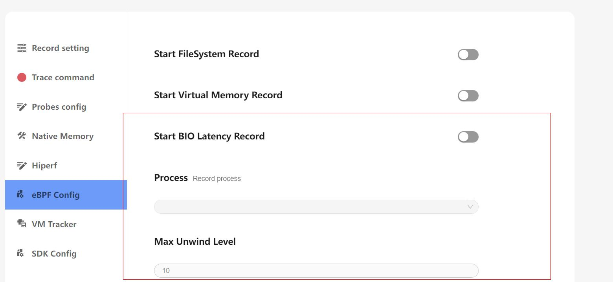
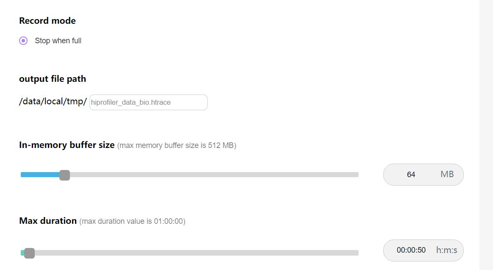
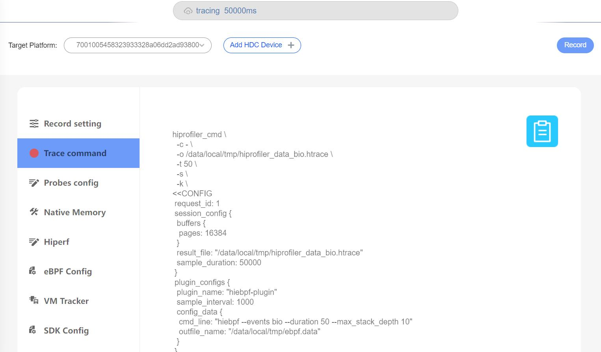
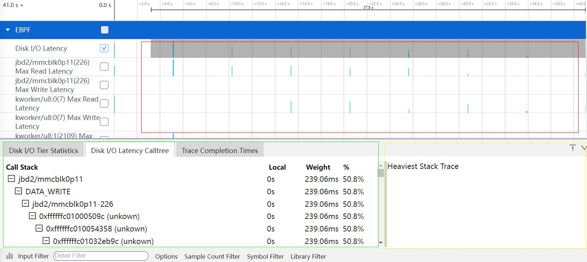

# Bio的抓取和展示说明

## 1.Bio的抓取

### 1.1.Bio抓取配置参数

 配置项说明
+     Start BIO Latency Record:配置项的总开关
+     Process：默认配置的是整个系统的,也可选择单进程抓取
+     Max Unwind Level：配置抓取调用栈的最大深度
再点击Record setting,在output file path输入文件名hiprofiler_data_bio.htrace,拖动滚动条设置buffer size大小是64M,抓取时长是50s

点击Trace command,就会根据上面的配置生成抓取命令,点击Record抓取，抓取过程中会显示抓取时长

### 2.Bio展示说明
抓取结束后Bio的trace会自动加载展示

界面布局介绍：页内存整体界面布局分为3个部分，其中
+     红色区域：泳道图
+     绿色区域：详细信息
+     黄色区域：辅助信息(Callstack)

### 2.1.Bio泳道图展示
Bio泳道图鼠标悬浮以10ms为区间展示该周期内最大的读或者写延迟

### 2.2.Bio泳道图的框选功能
可以对泳道图进行框选,框选后在最下方的弹出层中会展示框选数据的统计表格,总共有三个tab页
Disk I/O Tier Statistics的Tab页

+     Tier/Process/Path: 按照Tier,Process,Path的维度去展示
+     Count: 事件数量
+     Total Latency:每种进程，事件的总延迟
+     Min Total Latency：最小延迟时间
+     Avg Total Latency: 平均延迟时间
+     Max Total Latency：最大延迟时间
Disk I/O Latency Calltree的Tab页

+     Call Stack:为经过符号解析后的Callstack,并且给出动态链接库或者进程名的信息
+     Local:为该调用方法自身占用的CPU时间
+     Weight:调用方法的执行占比
Trace Completion Times的Tab页

+     Start:事件的开始时间
+     Total Latency:事件的延迟时间
+     Process：进程名（pid）
+     Thread：线程名（tid）
+     Latency per 4KB: 原始数据里没有，每4k数据的延迟时间，需要根据延迟的size跟延迟的时间去计算
+     Opration：事件类型
+     Bytes：延迟的数据量
+     Path: 操作的文件路径
+     Block Number:块数量
+     Tier: 层级
+     BackTrace;调用栈顶部函数，并显示调用栈深度
### 2.3.Bio支持多种Options展示风格
点击Disk I/O Latency Calltree的Tab页底部的Options,会有两个CheckBox复选框

+     Invert:反向输出调用树
+     Hide System so:隐藏系统库文件   
### 2.4.Bio支持过滤调用栈调用次数的展示风格
点击Disk I/O Latency Calltree的Tab页底部的Sample Counter Filter,可以填上区间值。过滤出符合该区间值调用次数的调用栈信息

### 2.5.Bio功能的调用栈Group展示-数据分析支持剪裁功能

+  裁剪Callstack,点击Callstack上一个节点符号，再点击底部Symbol Filter按钮，则该符号自动被裁剪掉，同时将该节点往下所有的Callstack内容裁剪掉

+ 裁剪Library，点击Library Filter按钮，则该库文件符号下所有的子节点也被裁剪
+ 点击Reset按钮，将恢复选中的裁剪内容
### 2.6.Bio功能的调用栈Group展示支持按条件过滤
在Input Filter输入关键字，会显示出带有该关键字的展示信息
 
### 2.7.Bio辅助信息区展示调用栈
当在详细信息区选择一个符号时，将展示与该符号相关的完整的调用栈。如下图的Heaviest Stack Trace：
 
 ### 2.8.Bio的Tier的过滤
 通过选择根据Tier去过滤
  
 ### 2.9.Bio的火焰图功能
点击Disk I/O Latency Calltree左下角的柱状图的图标,会切换到火焰图页面

进入到火焰图页面,火焰图的展示跟Callinfo的tab页的调用栈显示一致,鼠标放到色块上，悬浮框可以显示调用栈名称和Duration时长

鼠标左键火焰图，会进入下一级界面，右键回到上一级

