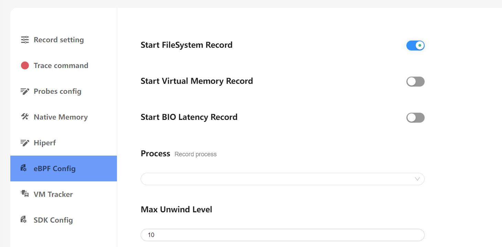
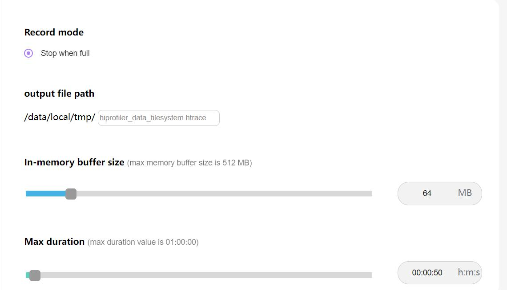
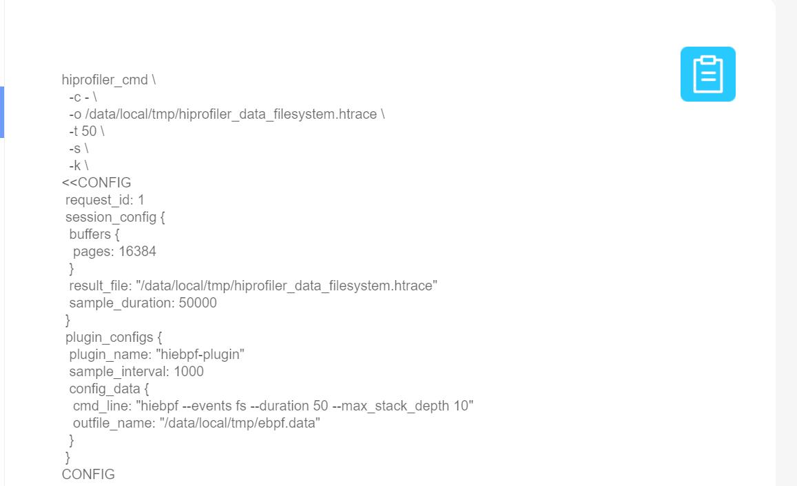
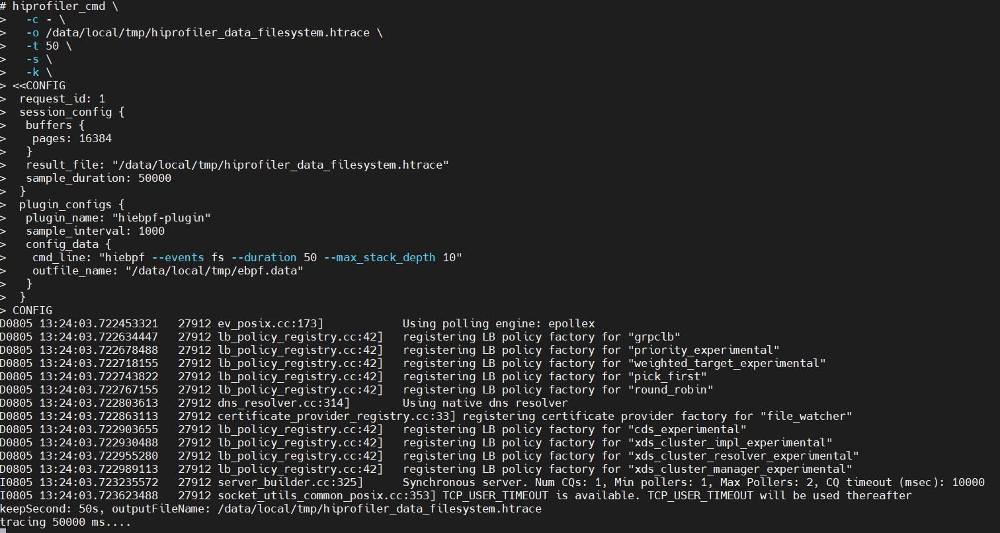
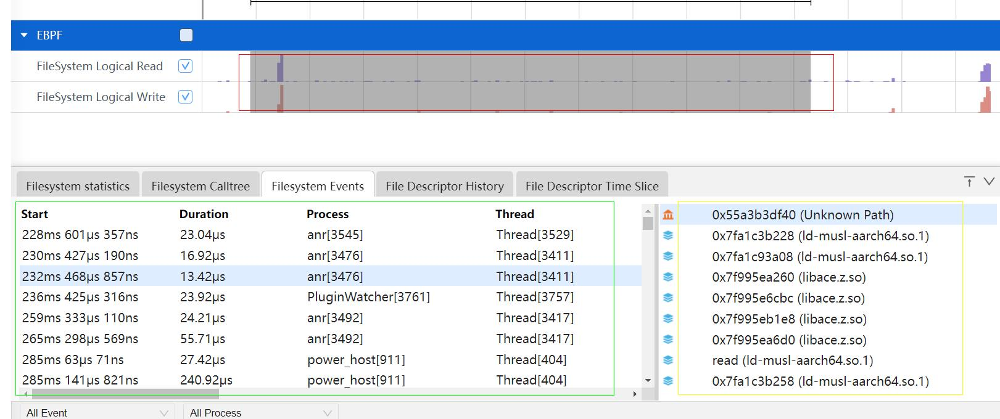

# FileSystem的抓取和展示说明

## 1.FileSystem的抓取
### 1.1.FileSystem抓取配置参数

 配置项说明
+     Start FileSystem Record:配置项的总开关
+     Process：默认配置的是整个系统的,也可选择单进程抓取
+     Max Unwind Level：配置抓取调用栈的最大深度

再点击Record setting,在output file path输入文件名hiprofiler_data_filesystem.htrace,拖动滚动条设置buffer size大小是64M,抓取时长是50s

点击Trace command,就会根据上面的配置生成抓取命令,点击复制按钮，会将命令行复制

输入hdc_std shell,进入设备，执行命令

执行完成后，进入指定目录查看，在/data/local/tmp下就会生成trace文件

### 2.FileSystem展示说明
将抓取的trace文件导入smartperf界面查看

界面布局介绍：FileSystem整体界面布局分为3个部分，其中
+     红色区域：泳道图
+     绿色区域：详细信息
+     黄色区域：辅助信息(Callstack)

### 2.1.FileSystem泳道图展示
FileSystem泳道图按照读操作和写操作展示,鼠标移动都泳道图上,悬浮框会以10ms为周期展示读,写类型系统调用的次数

按住w键放大界面，悬浮框会显示当前时刻的文件读写次数

### 2.2.FileSystem泳道图的框选功能
可以对读写操作泳道图进行框选,框选后在最下方的弹出层中会展示框选数据的统计表格,总共有五个tab页
FileSystem statistics的Tab页

+     Syscall/Process: 按照数据类型,进程分类显示
+     Count: 系统调用的数量
+     Logical Writes:写数据统计
+     Logical Reads:读数据统计
+     Other Filesystem Bytes:其他数据量
+     Duration:总时长
+     Min Duration：最小时长
+     Avg Duration: 平均时长
+     Max Duration：最大时长
FileSystem Calltree的Tab页

+     Call Stack:为经过符号解析后的Callstack,并且给出动态链接库或者进程名的信息
+     Local:为该调用方法自身占用的CPU时间
+     Weight:调用方法的执行占比
FileSystem Events的Tab页

+     Start: 起始时间
+     Duration:时长
+     Process:进程名
+     Thread:线程名
+     Firsr Argument:系统调用的第一个参数
+     Second Argument:系统调用的第二个参数
+     Third Argument:系统调用的第三个参数
+     Fourth Argument:系统调用的第四个参数
+     Retrun:系统调用的返回值
+     Error:错误码
+     Backtrace:调用栈顶部函数,并显示调用栈深度
File Descriptor History的Tab页

+     Start: 起始时间
+     Duration:时长
+     Process:进程名
+     Type:操作类型
+     File Descriptor:fd
+     Backtrace:调用栈顶部函数,并显示调用栈深度
File Descriptor Time Slice的Tab页

+     Open Time: 打开的起始时间
+     Open Duration:打开的时长
+     Process:进程名
+     File Descriptor:fd
+     Backtrace:调用栈顶部函数,并显示调用栈深度
### 2.3.FileSystem支持多种Options展示风格
点击FileSystem Calltree的Tab页底部的Options,会有两个CheckBox复选框

+     Invert:反向输出调用树
+     Hide System so:隐藏系统库文件   
### 2.4.FileSystem支持过滤调用栈调用次数的展示风格
点击FileSystem Calltree的Tab页底部的Sample Counter Filter,可以填上区间值。过滤出符合该区间值调用次数的调用栈信息

### 2.5.FileSystem功能的调用栈Group展示-数据分析支持剪裁功能

+  裁剪Callstack,点击Callstack上一个节点符号，再点击底部Symbol Filter按钮，则该符号自动被裁剪掉，同时将该节点往下所有的Callstack内容裁剪掉

+ 裁剪Library，点击Library Filter按钮，则该库文件符号下所有的子节点也被裁剪
+ 点击Reset按钮，将恢复选中的裁剪内容
### 2.6.FileSystem功能的调用栈Group展示支持按条件过滤
在Input Filter输入关键字，会显示出带有该关键字的展示信息
 
### 2.7.FileSystem辅助信息区展示调用栈
当在详细信息区选择一个符号时，将展示与该符号相关的完整的调用栈。如下图的Heaviest Stack Trace：
 
 ### 2.8.FileSystem的事件类型的过滤
 通过选择可以过滤是Open类型，还是Close类型事件
  
 ### 2.9.FileSystem的火焰图功能
点击FileSystem Calltre左下角的柱状图的图标,会切换到火焰图页面

进入到火焰图页面,火焰图的展示跟Callinfo的tab页的调用栈显示一致,鼠标放到色块上，悬浮框可以显示调用栈名称和Duration时长

鼠标左键火焰图，会进入下一级界面，右键回到上一级

