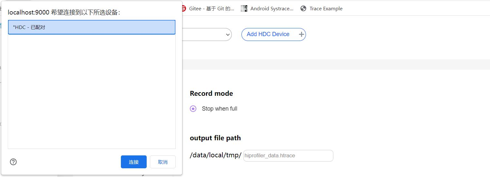
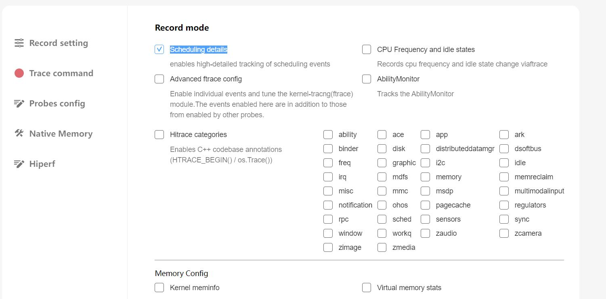
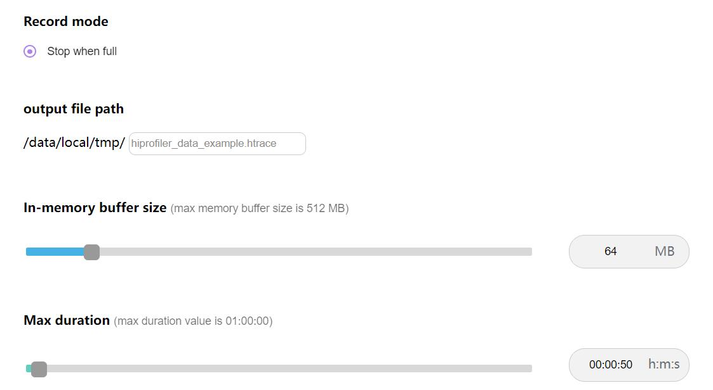
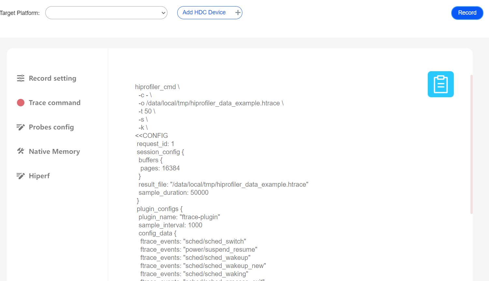
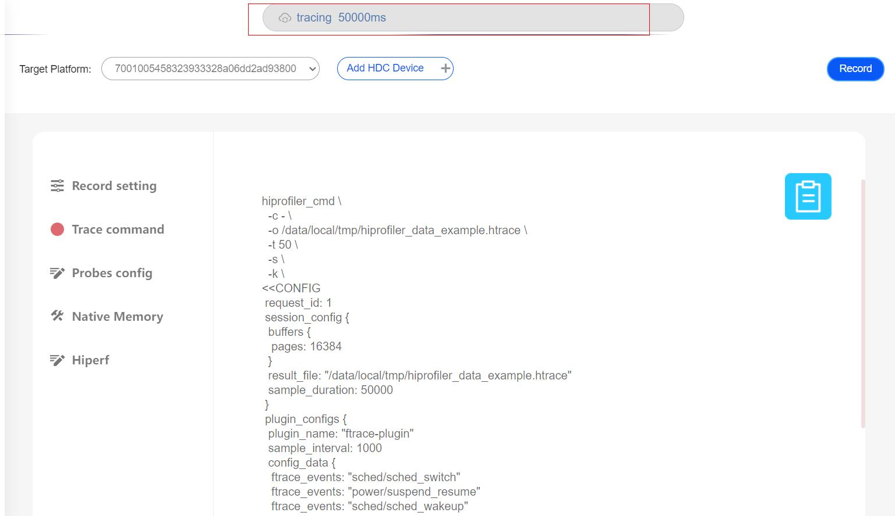
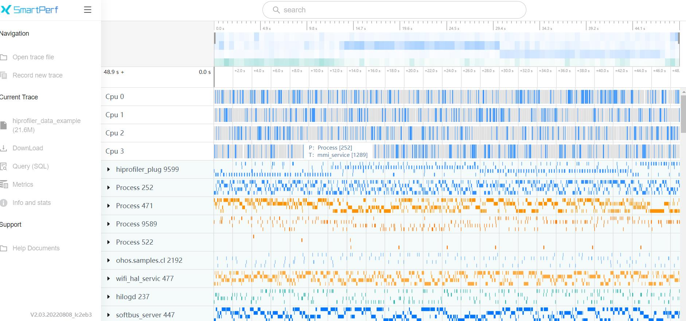

# 在线抓取trace说明

## 1.界面配置说明

说明：
* Record:trace抓取按钮
* Add HDC Device:连接设备

## 2.trace文件的在线抓取
点击Add HDC Device在弹出的框里选择HDC-配对,点击连接,连接设备

点击Probes config,如选择抓取Scheduling details

再点击Record setting,在output file path输入文件名hiprofiler_data_example.htrace,拖动滚动条设置buffer size大小是64M,抓取时长是50s

点击Trace command,就会根据上面的配置生成抓取命令,点击Record

抓取过程中,上方会给出提示正在抓取,并显示出抓取时长

抓取完成后,界面会自动加载展示trace文件
