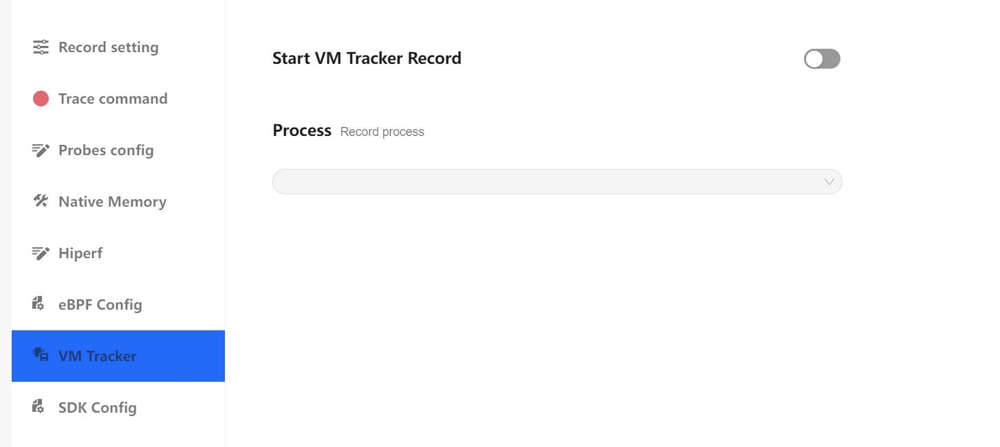
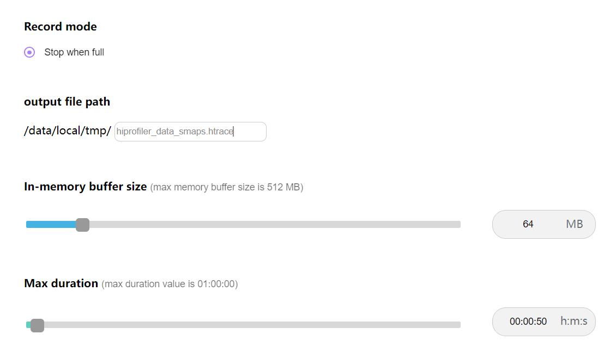
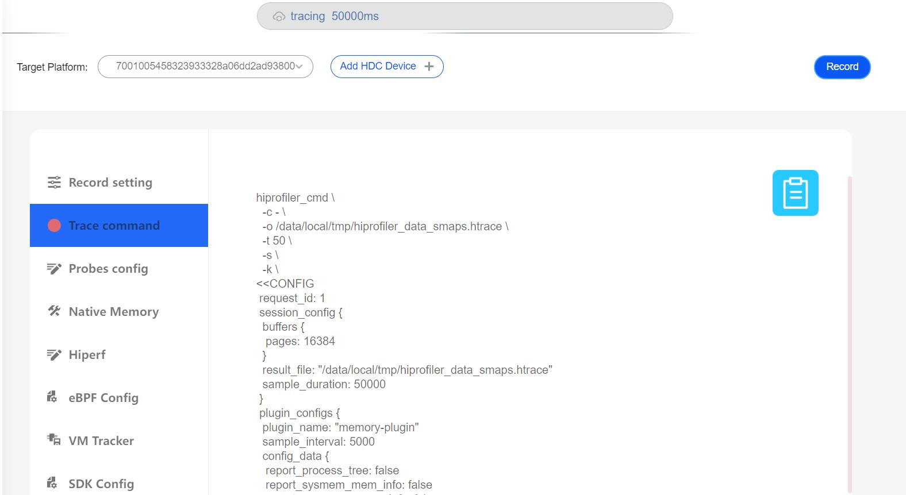
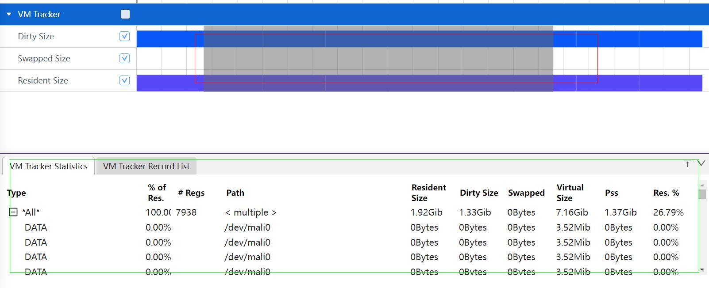
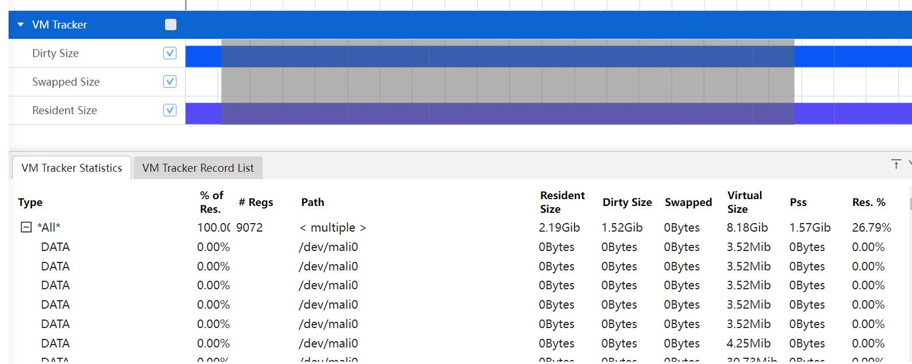
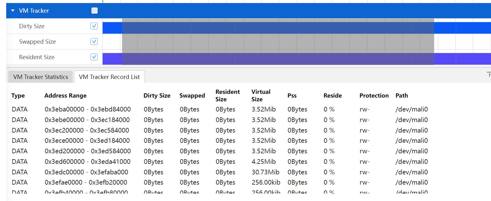

# 进程smaps的抓取和展示说明

## 1.smaps的抓取

### 1.1.smaps抓取配置参数

 配置项说明
+     Start VM Tracker Record:配置项的总开关
+     Process：smaps的抓取只能选择单进程抓取

再点击Record setting,在output file path输入文件名hiprofiler_data_smaps.htrace,拖动滚动条设置buffer size大小是64M,抓取时长是50s

点击Trace command,就会根据上面的配置生成抓取命令,点击Record抓取，抓取过程中会显示抓取时长

### 2.smaps展示说明
抓取结束后smaps的trace会自动加载展示

界面布局介绍：smaps整体界面布局分为3个部分，其中
+     红色区域：泳道图
+     绿色区域：详细信息

### 2.1.smaps泳道图展示
smaps泳道图展示当前时刻该进程的内存消耗

### 2.2.smaps泳道图的框选功能
可以对泳道图进行框选,框选后在最下方的弹出层中会展示框选数据的统计表格,总共有两个个tab页
VM Tracker Statistics的Tab页

+     Type: 将抓取到的信息根据Type归类，分四类，Data,Text,Const,Other
+     % of Res: 每行的Resident Size 占总Ressident Size的比例
+     #Reg:统计的类型个数
+     Path：虚拟内存块路径,类型中有多个则显示multiple
+     Resident Size: smaps节点中Rss(Shared_Clean+Shared_Dirty+Private_Clean+Private_Dirty)
+     Dirty Size：smaps节点中Shared_Dirty + Private_Dirty
+     Swapped: smaps节点中Swap + SwapPss
+     Virtual Size：smaps节点中Size
+     Pss: smaps节点中Pss
+     Res. %：Resident Size / Virtual Size 比值
VM Tracker Record List的Tab页

+     Type: 将抓取到的信息根据Type归类，Data,Text,Const,Other
+     Address Range: 每段虚拟内存段的开始和结束位置
+     Dirty Size：smaps节点中Shared_Dirty + Private_Dirty
+     Swapper: smaps节点中Swap + SwapPss
+     Resident Size：smaps节点中Rss(Shared_Clean+Shared_Dirty+Private_Clean+Private_Dirty)
+     Virtual Size:smaps节点中Size
+     Pss:smaps节点中Pss
+     Reside: Rss / Size 比值
+     Protection: 内存块的权限(读写执行执行)
+     Path: 内存段路径