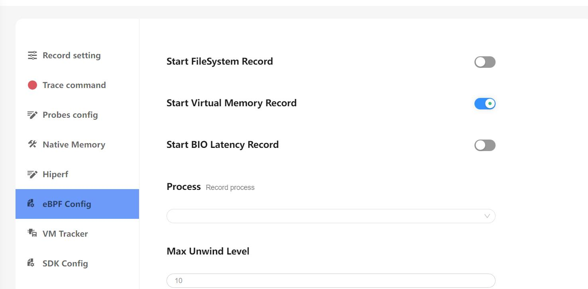
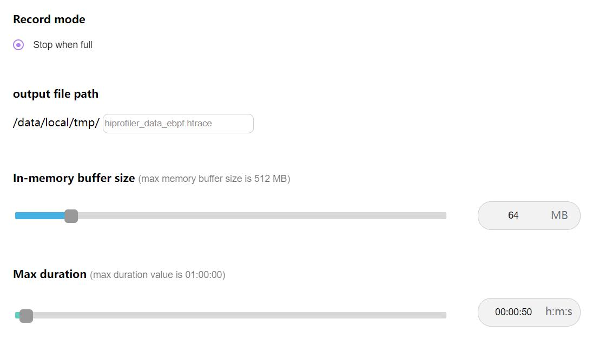
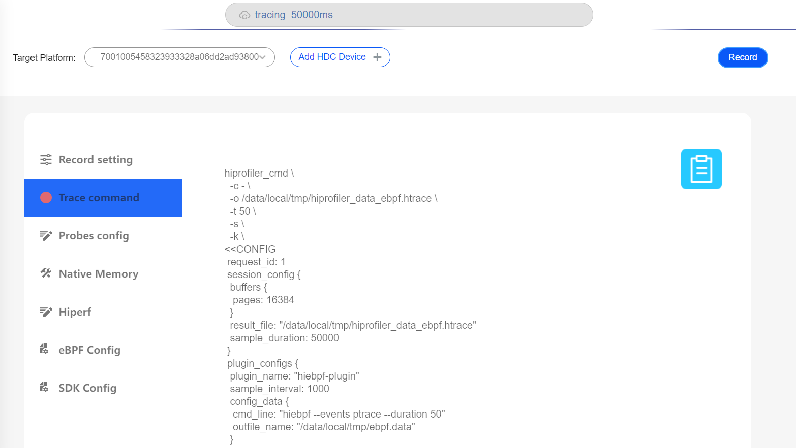
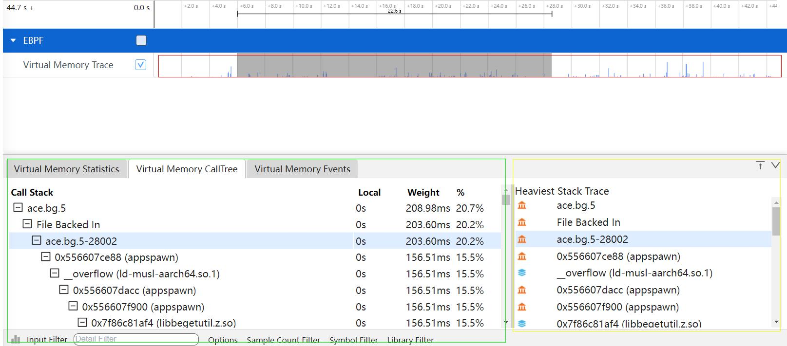
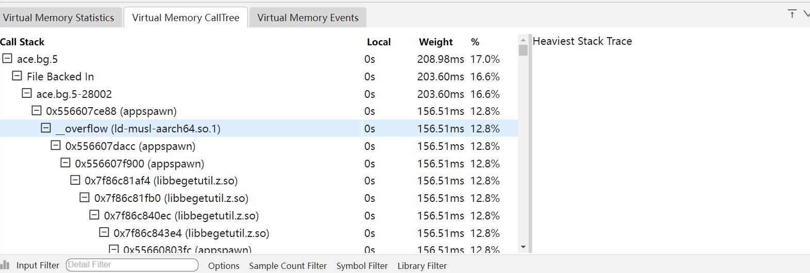
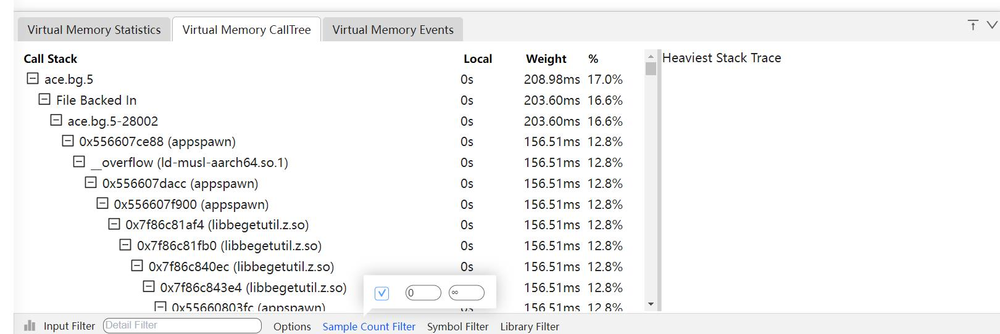

# 页内存的抓取和展示说明

## 1.页内存的抓取

### 1.1.页内存抓取配置参数

 配置项说明
+     Start Virtual Memory Record:配置项的总开关
+     Process：默认配置的是整个系统的,也可选择单进程抓取
+     Max Unwind Level：配置抓取调用栈的最大深度

再点击Record setting,在output file path输入文件名hiprofiler_data_ebpf.htrace,拖动滚动条设置buffer size大小是64M,抓取时长是50s

点击Trace command,就会根据上面的配置生成抓取命令,点击Record抓取，抓取过程中会显示抓取时长

### 2.页内存展示说明
抓取结束后页内存的trace会自动加载展示

界面布局介绍：页内存整体界面布局分为3个部分，其中
+     红色区域：泳道图
+     绿色区域：详细信息
+     黄色区域：辅助信息(Callstack)

### 2.1.页内存泳道图展示
页内存泳道图展示事件(Operation)发生的次数,每个事件都有持续时间,鼠标悬浮以10ms为区间进行次数统计

按住w键放大界面，悬浮框会显示当前时刻的事件发生次数

### 2.2.页内存泳道图的框选功能
可以对泳道图进行框选,框选后在最下方的弹出层中会展示框选数据的统计表格,总共有三个tab页
Virtual Memory Statistics的Tab页

+     Operation/Process/Thread: 按照Operation为基点显示
+     Count: 事件数量
+     Duration:总时长
+     Min Duration：最小时长
+     Avg Duration: 平均时长
+     Max Duration：最大时长
点击下方的Statistics by Thread,可以切换到按照Thread为基点显示数据

Virtual Memory Calltree的Tab页

+     Call Stack:为经过符号解析后的Callstack,并且给出动态链接库或者进程名的信息
+     Local:为该调用方法自身占用的CPU时间
+     Weight:调用方法的执行占比
Virtual Memory Events的Tab页

+     Start Time:起始时间
+     Duration:时长
+     Thread:线程名
+     Operation:事件类型
+     Address:内存地址
+     Size:内存大小

### 2.3.页内存支持多种Options展示风格
点击Virtual Memory Calltree的Tab页底部的Options,会有两个CheckBox复选框

+     Invert:反向输出调用树
+     Hide System so:隐藏系统库文件   

### 2.4.页内存支持过滤调用栈调用次数的展示风格
点击Virtual Memory Calltree的Tab页底部的Sample Counter Filter,可以填上区间值。过滤出符合该区间值调用次数的调用栈信息

### 2.5.页内存功能的调用栈Group展示-数据分析支持剪裁功能

+  裁剪Callstack,点击Callstack上一个节点符号，再点击底部Symbol Filter按钮，则该符号自动被裁剪掉，同时将该节点往下所有的Callstack内容裁剪掉

+ 裁剪Library，点击Library Filter按钮，则该库文件符号下所有的子节点也被裁剪
+ 点击Reset按钮，将恢复选中的裁剪内容

### 2.6.页内存功能的调用栈Group展示支持按条件过滤
在Input Filter输入关键字，会显示出带有该关键字的展示信息
 
 
### 2.7.页内存辅助信息区展示调用栈
当在详细信息区选择一个符号时，将展示与该符号相关的完整的调用栈。如下图的Heaviest Stack Trace：
 
 
 ### 2.8.页内存的事件类型的过滤
 通过选择可以过滤是File Backed In类型，还是Copy On Write类型事件
  
  
 ### 2.9.页内存的火焰图功能
点击Virtual Memory Calltree左下角的柱状图的图标,会切换到火焰图页面

进入到火焰图页面,火焰图的展示跟Callinfo的tab页的调用栈显示一致,鼠标放到色块上，悬浮框可以显示调用栈名称和Duration时长

鼠标左键火焰图，会进入下一级界面，右键回到上一级

