# 调用栈可视化和不同库函数调用占比说明
调用栈可视化可以将开发者编译的so符号化结果展示出来，不同库函数的占比通过饼图的方式展示出来。
## Native Memory文件的不同库函数占比
Native Memory分为三级统计，分别按照内存分配的类型(Alloc/Mmap)，lib库，函数进行统计分析。其中lib跟函数为每一条调用栈，从栈顶往下查找，非musl库与c++库的第一条函数及其lib为每次分配归属的函数及lib库。
点击Analysis的Tab页，先以内存分配的类型去统计。
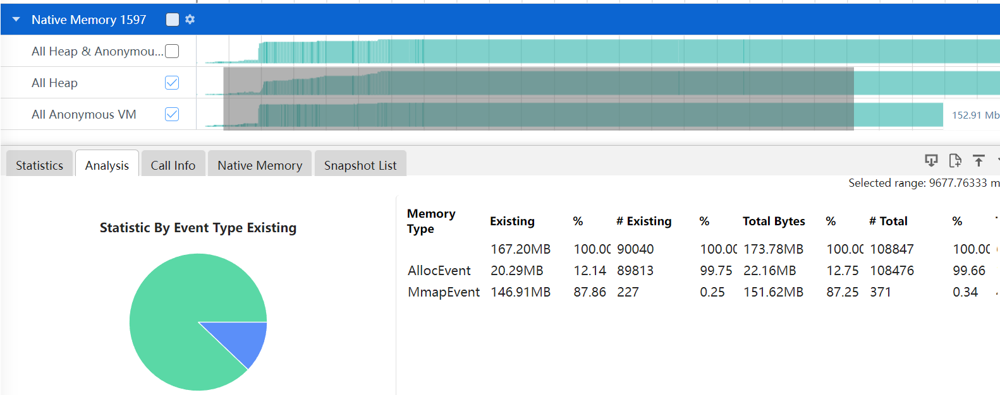
+     Memory Type：事件类型。
+     Existing：框选区域内申请没有释放的大小。
+     #Existing：框选区域内申请没有释放的次数。
+     Total Bytes：框选区间内申请的大小。
+     #Total：框选区间内申请的次数。
+     Transient：框选区域内释放的大小。
+     #Transient：框选区域内释放的次数。
+     %：各个显示项的占比。
以lib库去统计，如图显示的是AllocEvent的so占比的饼图和Table表。
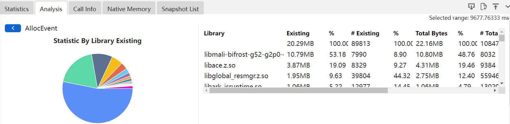
+     Library：So名称。
+     Existing：框选区域内申请没有释放的大小。
+     #Existing：框选区域内申请没有释放的次数。
+     Total Bytes：框选区间内申请的大小。
+     #Total：框选区间内申请的次数。
+     Transient：框选区域内释放的大小。
+     #Transient：框选区域内释放的次数。
+     %：各个显示项的占比。
以函数去统计，如图显示的是AllocEvent/libmali-bifrost-g52-g2p0-ohos.so的函数占比的饼图和Table表。
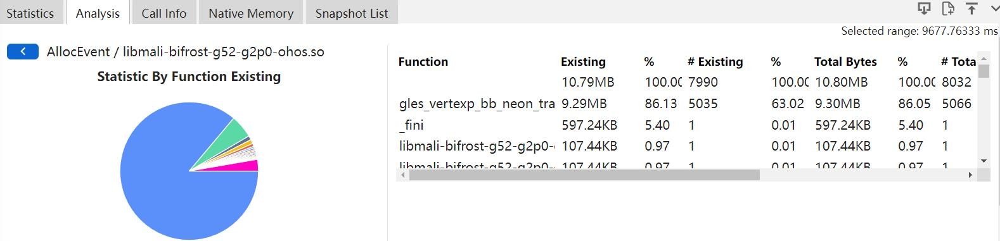
+     Function：函数名称。
+     Existing：框选区域内申请没有释放的大小。
+     #Existing：框选区域内申请没有释放的次数。
+     Total Bytes：框选区间内申请的大小。
+     #Total：框选区间内申请的次数。
+     Transient：框选区域内释放的大小。
+     #Transient：框选区域内释放的次数。
+     %：各个显示项的占比。
## Hiperf文件的不同库函数占比
Hiperf分为四级统计，分别按照进程，线程，lib库，函数进行统计。其中lib跟函数为每一条调用栈的栈顶函数及其lib。
点击Analysis的Tab页，先以进程去统计。
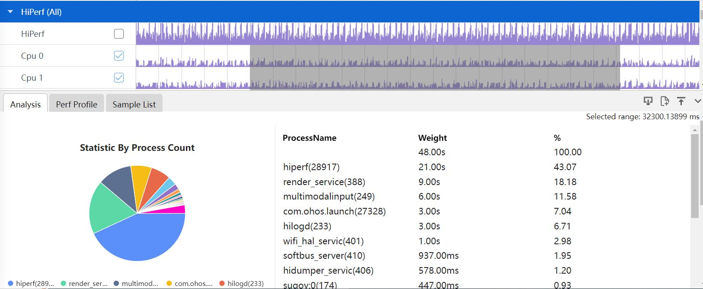
+     ProcessName：进程名。
+     Weight：该进程下的调用方法的执行次数。
+     %：该进程下的调用方法的执行占比。
以线程统计，如图显示的是hiperf进程下的线程的饼图和Table表。
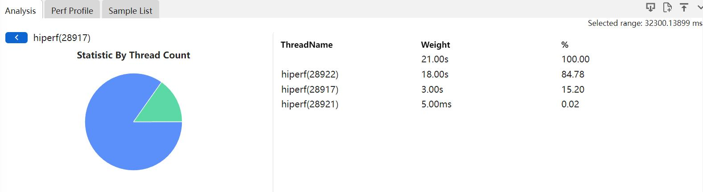
+     ThreadName：线程名。
+     Weight：该线程下的调用方法的执行次数。
+     %：该线程下的调用方法的执行占比。
以lib库统计，如图显示的是hiperf线程下的各so占比饼图和Table表。
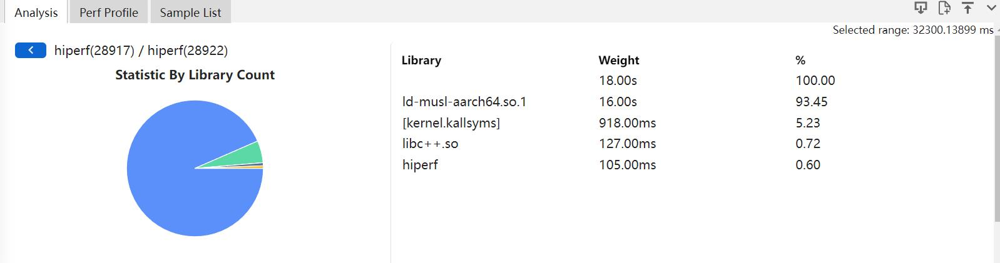
+     Library：so的名称。
+     Weight：该so的调用方法的执行次数。
+     %：该so的调用方法的执行占比。
以函数统计，如图显示的是ld-musl-aarch64.so.1下的各函数占比饼图和Table表。
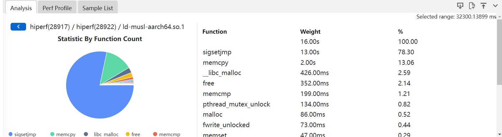
+     Library：so的名称。
+     Weight：该so的调用方法的执行次数。
+     %：该so的调用方法的执行占比。
## FileSystem文件的不同库函数占比
FileSystem分为五级统计，分别按照进程，系统调用类型，线程，lib库，函数进行统计。其中lib跟函数为每一条调用栈，从栈顶往下查找，非musl库与c++库的第一条函数及其lib为每次分配归属的函数及lib库。
点击Analysis的Tab页，先以进程去统计。
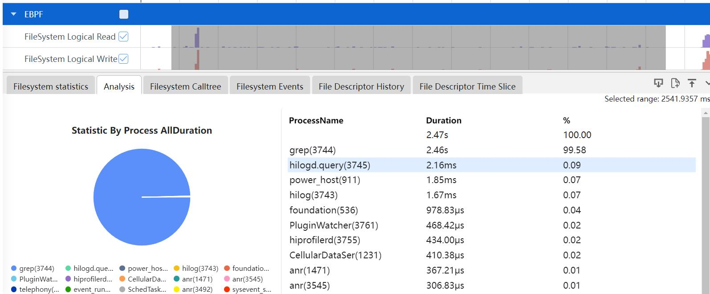
+     ProcessName：进程名。
+     Duration：总时长。
+     %：总时长占比。
以系统调用类型统计，如图显示的是grep进程下的Read和Write系统调用的时长占比饼图和Table表。
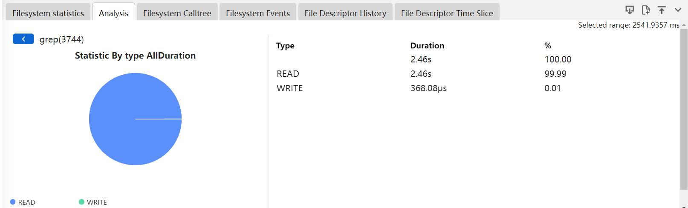
+     Type：系统调用类型(Read和Write)。
+     Duration：系统调用的总时长。
+     %：总时长占比。
以线程统计，如图显示的是系统调用是Read类型的线程的占比饼图和Table表。

+     ThreadName：线程名。
+     Duration：该线程的系统调用的总时长。
+     %：总时长占比。
以lib库统计，如图显示toybox的lib库的占比饼图和Table表。
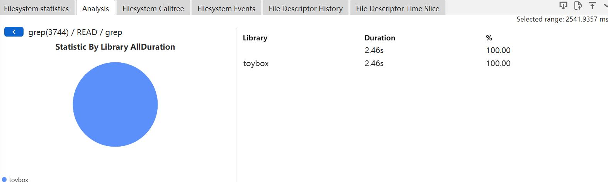
+     Library：so的名称。
+     Duration：该so的系统调用的总时长。
+     %：总时长占比。
以函数统计，如图显示0x558111afbc (toybox)的函数占比饼图和Table表。
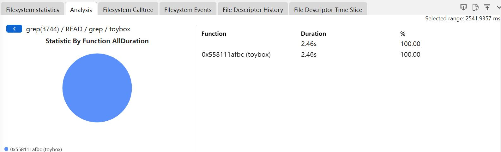
+     Function：函数名称。
+     Duration：该函数的系统调用的总时长。
+     %：总时长占比。
## Bio文件的不同库函数占比
Bio分为五级统计，分别按照进程，系统调用类型，线程，lib库，函数进行统计。其中lib跟函数为每一条调用栈，从栈顶往下查找，非submit_bio第一条函数及其lib为每次分配归属的函数及lib库。
点击Analysis的Tab页，先以进程去统计。
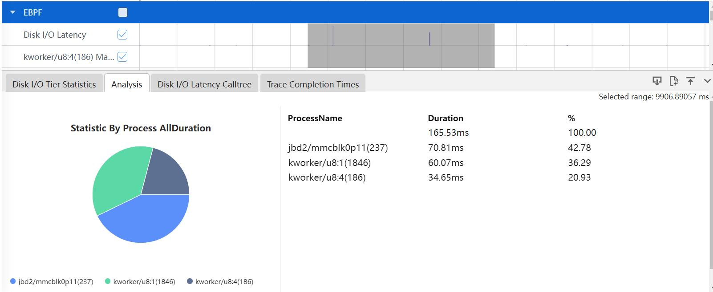
+     ProcessName：进程名。
+     Duration：总时长。
+     %：总时长占比。
以系统调用类型统计，如图显示的是jbd2/mmcblk0p11进程下的DATA_WRITE系统调用的时长占比饼图和Table表。
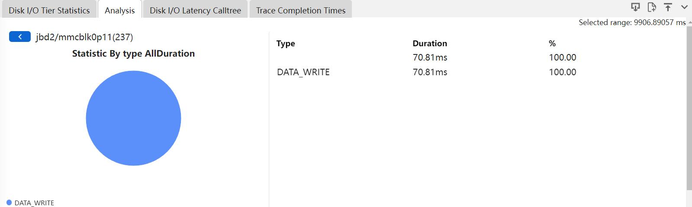
+     Type：系统调用类型。
+     Duration：系统调用的总时长。
+     %：总时长占比。
以线程统计，如图显示的是系统调用是DATA_WRITE类型的线程的占比饼图和Table表。
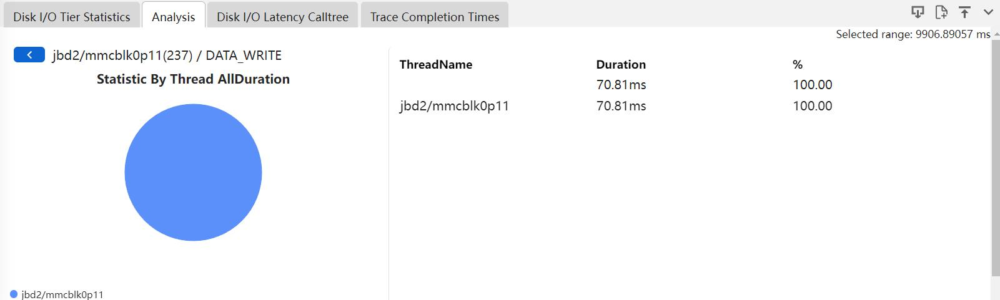
+     ThreadName：线程名。
+     Duration：该线程的系统调用的总时长。
+     %：总时长占比。
以lib库统计，如图显示kallsyms的lib库的占比饼图和Table表。
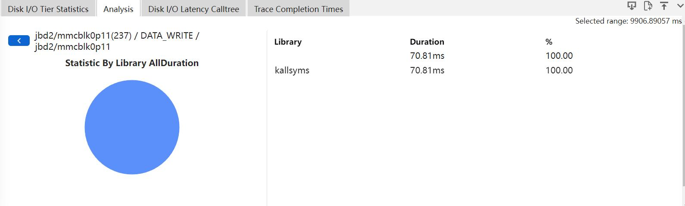
+     Library：so的名称。
+     Duration：该so的系统调用的总时长。
+     %：总时长占比。
以函数统计，如图显示submit_bh的函数占比饼图和Table表。
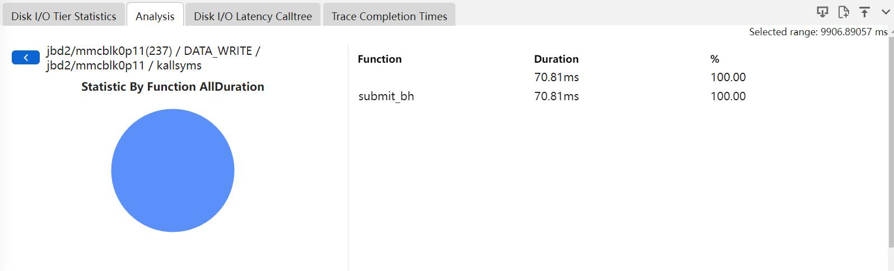
+     Function：函数名称。
+     Duration：该函数的系统调用的总时长。
+     %：总时长占比。
## Page Fault文件的不同库函数占比
Page Fault分为五级统计，分别按照进程，系统调用类型，线程，lib库，函数进行统计。其中lib跟函数为每一条调用栈，从栈顶往下查找，非musl库与c++库的第一条函数及其lib为每次分配归属的函数及lib库。
点击Analysis的Tab页，先以进程去统计。
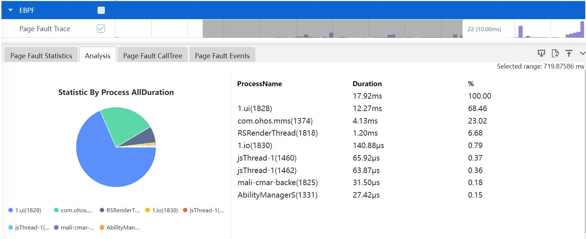
+     ProcessName：进程名。
+     Duration：总时长。
+     %：总时长占比。
以系统调用类型统计，如图显示的是1.ui进程下的File Backed In和Copy On Writer系统调用的时长占比饼图和Table表。
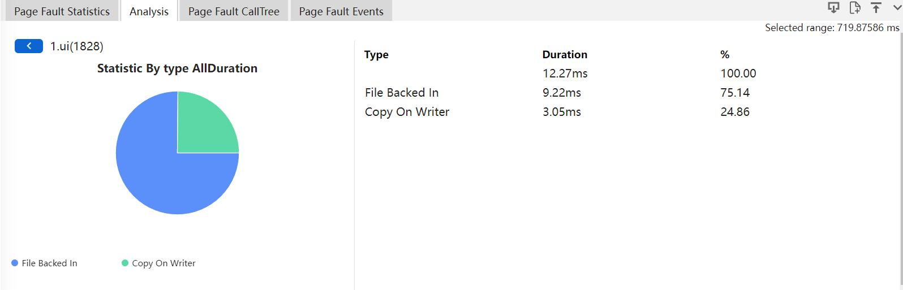
+     Type：系统调用类型。
+     Duration：系统调用的总时长。
+     %：总时长占比。
以线程统计，如图显示的是系统调用是File Backed In类型的线程的占比饼图和Table表。
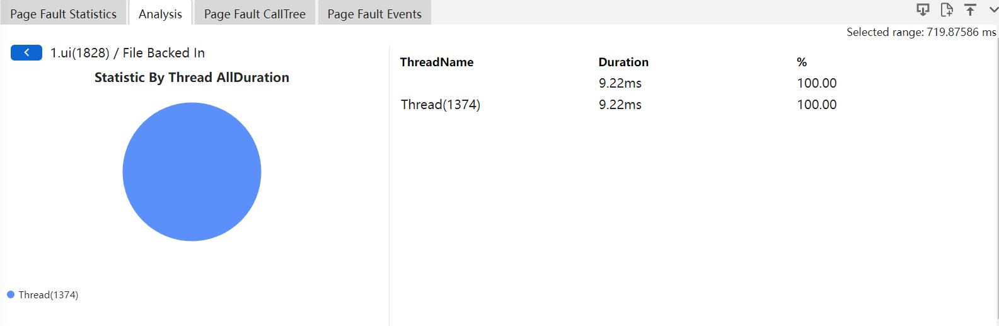
+     ThreadName：线程名。
+     Duration：该线程的系统调用的总时长。
+     %：总时长占比。
以lib库统计，如图显示各lib库的占比饼图和Table表。
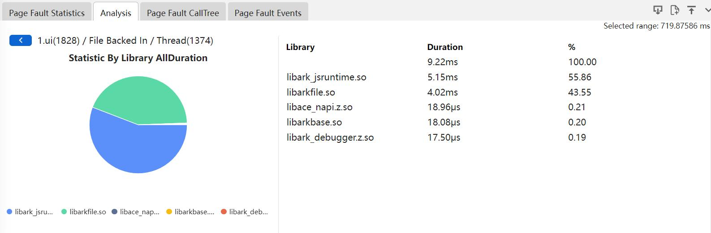
+     Library：so的名称。
+     Duration：该so的系统调用的总时长。
+     %：总时长占比。
以函数统计，如图显示各函数占比饼图和Table表。
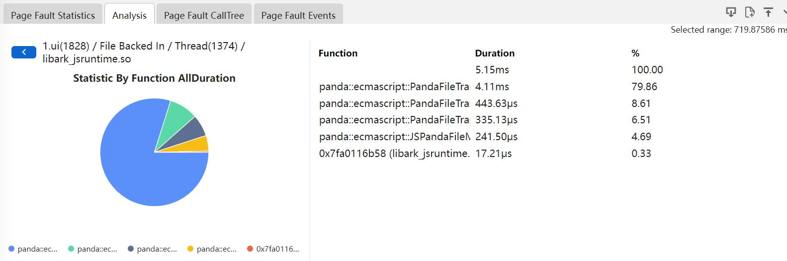
+     Function：函数名称。
+     Duration：该函数的系统调用的总时长。
+     %：总时长占比。
## 可导入符号表说明
符号表导入适用于所有支持调用栈的Tab页，选择一个文件夹，获取文件下及其子文件夹的所有so文件，更新数据库中符号数据。文件夹内so的格式需要与在设备上的路径一致，例如下图中，选择的文件夹为import，选择导入的libnative_hook.z.so，在设备上的路径是/system/lib64/，那么在本地选择的文件夹内也需要保证路径是import/system/lib64/libnative_hook.z.so。

以NativeMemory举例，导入NativeMemory文件，点击Call info的Tab页，在搜索框中输入libnative_hook.z.so，会发现该so下的调用栈没有符号化完全。
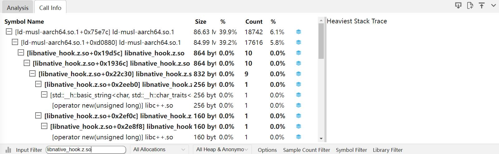
将本地编译的so通过导入按钮导入，本地导入路径是import/system/lib64/libnative_hook.z.so，红框处是导入按钮
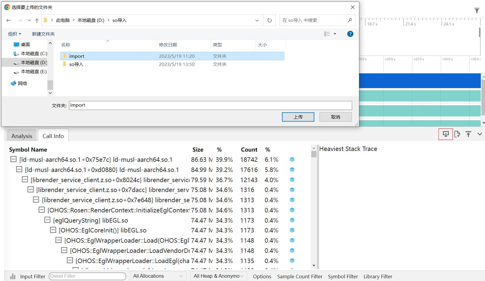
导入so以后，在搜索框中输入libnative_hook.z.so，会发现符号化数据已经更新
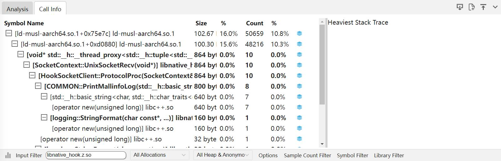