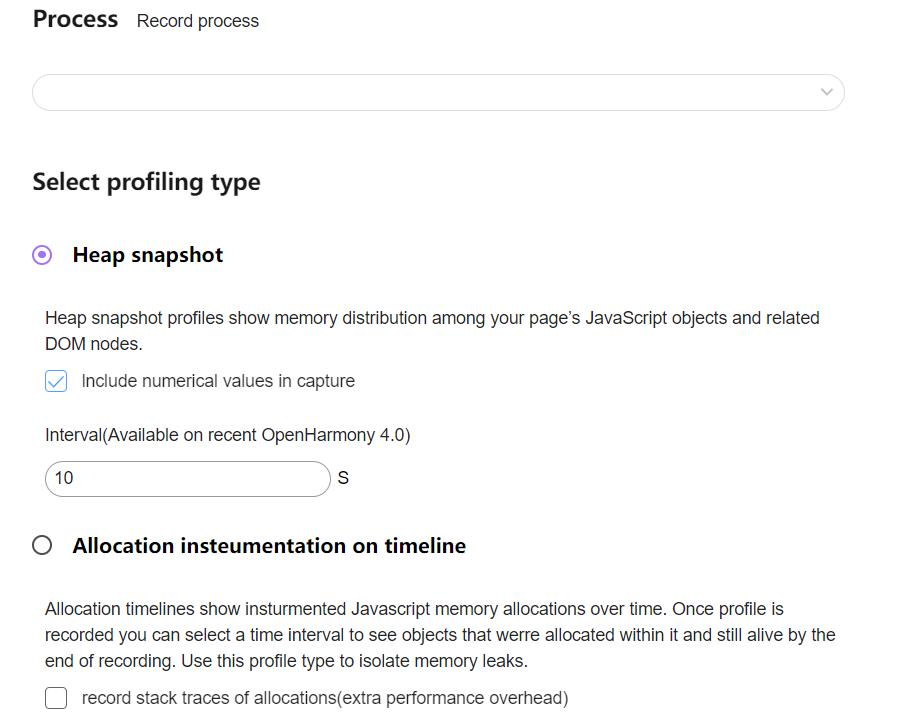
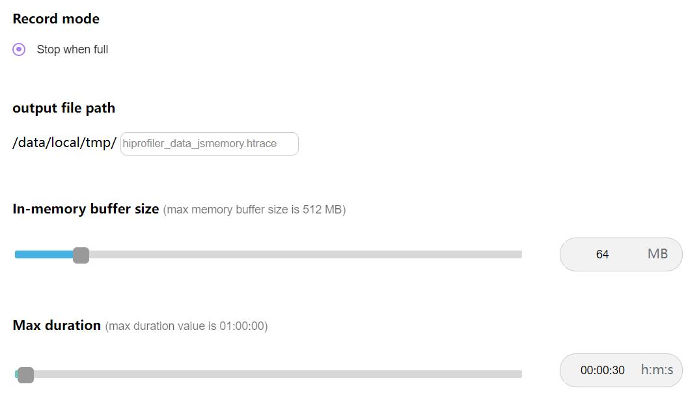
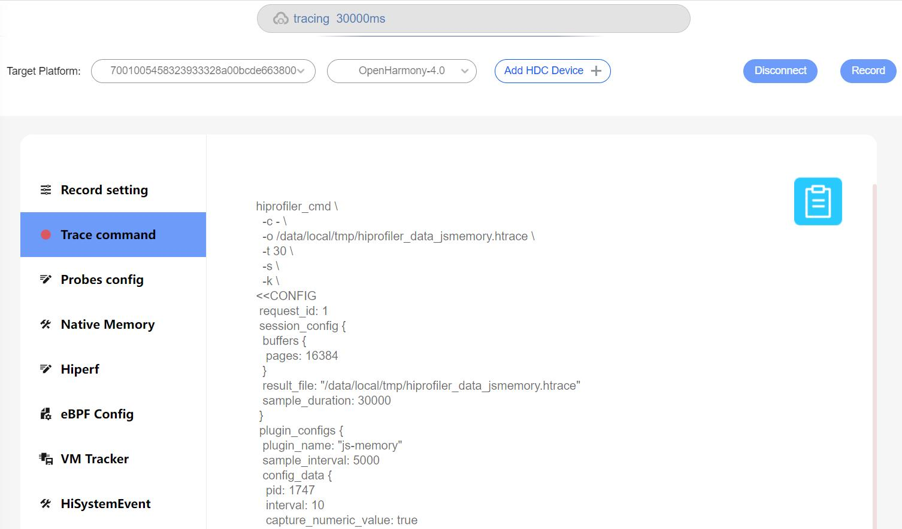
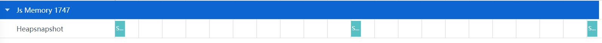
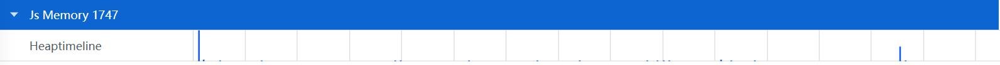
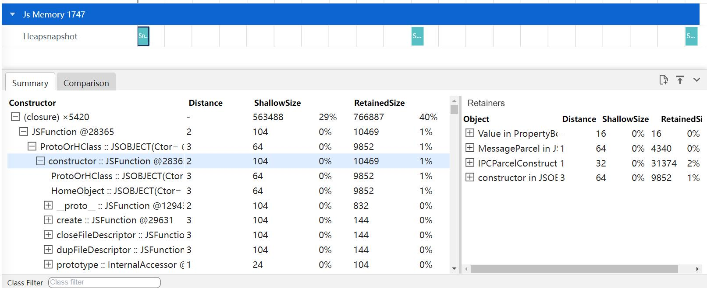
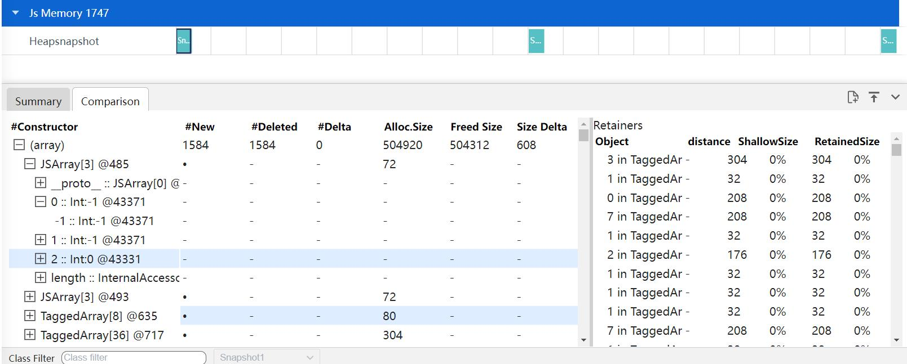
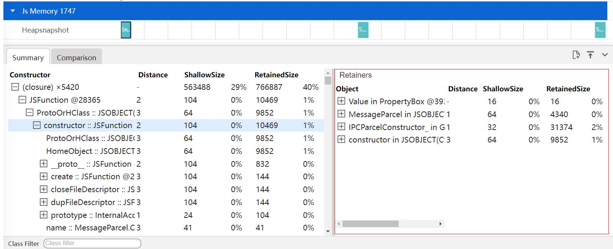
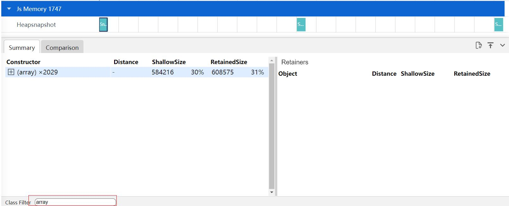

# Js Memory抓取和展示说明
Js Memory是查看程序中存量内存的情况。
## Js Memory的抓取
### Js Memory抓取配置参数

配置参数说明：
* Process：设置抓取的进程ID，此处以1747进程号为例。
* Heap snapshot：堆快照性能分析会显示网页的JavaScript对象和相关DOM节点中内存分配情况。
* include numerical values in capture：在快照中添加数字。
* Interval：抓取的时间间隔。
* Allocation insteumentation on timeline：分配时间轴显示了插桩的JavaScript内存分配随时间变化的情况。
* record stack traces of allocations(extra performance overhead)：录制各项分配的堆栈轨迹(会产生额外的性能开销)。

再点击Record setting，在output file path输入文件名hiprofiler_data_jsmemory.htrace，拖动滚动条设置buffer size大小是64M，抓取时长是30s。

点击Trace command，就会根据上面的配置生成抓取命令，点击Record抓取，抓取过程中会显示抓取时长。

## Js Memory展示说明
将抓取的jsmemory文件导入到smartperf工具中查看，查看程序中存量内存的情况。
### Js Memory泳道图展示类型
堆快照类型文件的泳道图展示。

+     Heapsnapshot：堆快照性能分析会显示网页的JavaScript对象和相关DOM节点中内存分配情况。
时间轴上分配插桩类型文件的泳道图展示。

+     Heaptimeline：分配时间轴显示了插桩的JavaScript内存分配随时间变化的情况。

### Js Memory泳道图的框选功能
可以对内存的数据进行框选，框选后在最下方的弹出层中会展示框选数据的统计表格，总共有两个tab页。
Summary的Tab页，主要显示了总览视图，通过类的名称来分组显示对象。

+     Constructor：类创建的所有对象，其中
                    第一层为类名，后面的x表示该类创建了多少实例。
                    第二层为该类的实例名+id，id唯一。
                    第三层以下为实例中的成员变量。
+     Distance：使用节点的最短简单路径显示到根的距离。
+     ShallowSize：类创建的所有对象的本身的内存大小之和。
+     RetainedSize：对象以及其相关的对象一起被删除后所释放的内存大小，同一组对象之间的最大保留大小。
Comparison的Tab页，主要显示了比较视图，显示两份快照间的不同之处，主要比较类创建与释放的实例数量。

+     #Constructor：类创建的所有对象，类名与id相同视为同一个实例，其中
                    第一层为类的比较，每个时间点的对比其他时间点的类创建与销毁了哪些实例。
                    第二层为实例，由于展示的是创建或者销毁实例，固只展示Size大小。
                    第三层以下为实例的成员变量，不存在比较信息。
+     #New：新增的实例数量，圆点代表有意义的数据，下划线代表无意义的数据。
+     #Deleted：删除的实例数量。
+     #Delta：#New减去#Deleted的数量。
+     Alloc.Size：新增实例的Size。
+     Freed Size：删除实例的Size。
+     Size Delta：Delta的Size。
### Js Memory的辅助信息功能
在Summary和Comparison的Tab页，选中左边实例，右边Retainers的Tab页会显示多少个实例引用了左边选中的实例。

+     Object：引用的实例。
+     Distance：使用节点的最短简单路径显示到根的距离。
+     ShallowSize：所有对象的本身的内存大小之和。
+     RetainedSize：对象以及其相关的对象一起被删除后所释放的内存大小，同一组对象之间的最大保留大小。
### Js Memory详细显示的过滤功能
在下方的Class Filter中输入类名，可以对类名进行过滤，如下图输入array，会过滤出类名是array的相关数据。
