# web端加载trace说明
从web端查看trace文件，进行性能检测的分析。
## 文件加载入口
将抓取的trace导入查看。
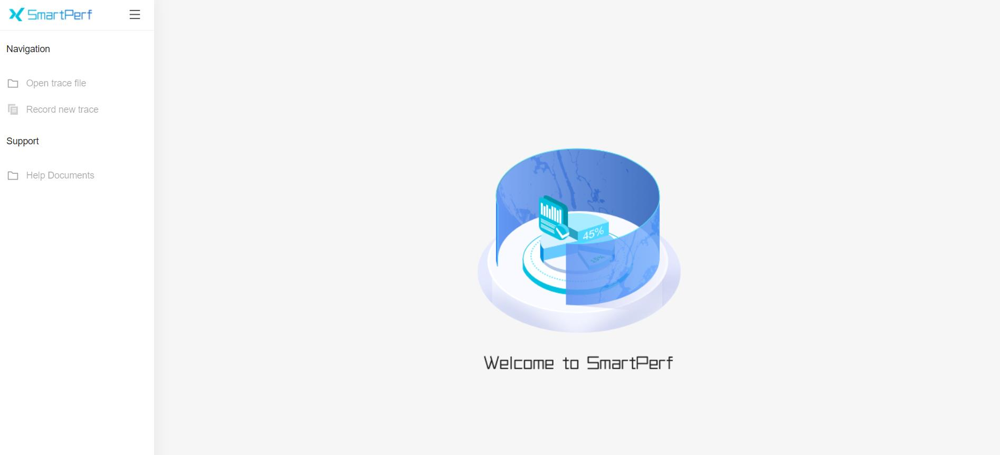

说明：
+ Open trace file：导入离线trace文件入口。
+ Record new trace：抓取新的trace文件入口。

## 导入trace文件后显示页面
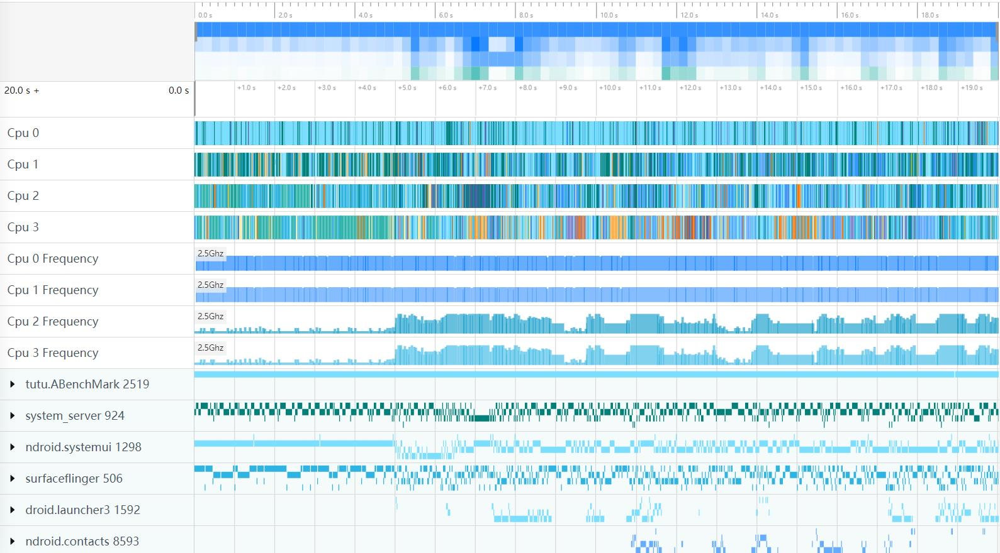
说明：
+ 操作说明：在当前页面可以通过键盘上的wasd四个键位操纵当前的时间轴进行缩放，w为放大，s为缩小，a为左移，d为右移。
## trace功能介绍
trace模块从上往下主要展示时间轴、cpu使用率、cpu使用情况、进程间通讯数据的方法调用情况、进程、线程和方法调用情况。
### 时间轴和cpu使用率

最上方带刻度的为时间轴，主要展示当前抓取数据的总时长和时间刻度的分布情况，如上图所示，左下角展示总时长。
中间区域展示的是抓取数据时间段内的cpu使用率，颜色越深代表cpu使用率越高，颜色越浅代表cpu使用率越低。

在白色背景时间轴区域内可以点击后拖拽鼠标，可以对从鼠标按下到拖拽完成鼠标松开的区域内的数据进行筛选，高亮显示的部分为当前所选区域，如上图所示。
### cpu使用情况

 
如上图所示，当前抓取数据有4个cpu工作，前四组数据对应的是当前调用cpu的线程和对应的进程情况，以颜色作为区分。后四组数据则为cpu的使用频率信息。鼠标移动到相应的线程上还会将当前选中的进程信息全部置为高亮，其他的进程会置灰，如下图所示。

#### cpu使用情况的框选功能
可以对cpu的数据进行框选，框选后在最下方的弹出层中会展示框选数据的统计表格,总共有七个tab页。
CPU by thread的Tab页，主要显示了在框选时间区间内的进程名、进程号、线程名、线程号、总运行时长、平均运行时长和调度次数信息。
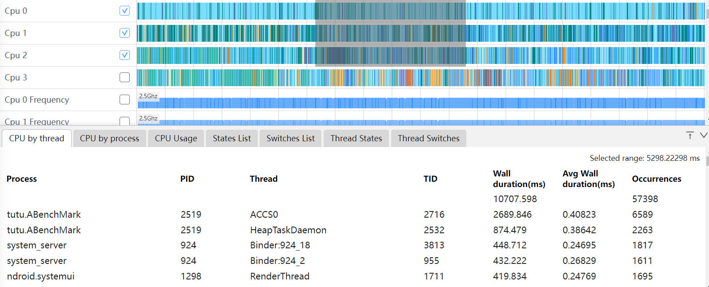
CPU by process的Tab页，主要显示了在框选时间区间内的进程名、进程号、总运行时长、平均运行时长和调度次数信息。
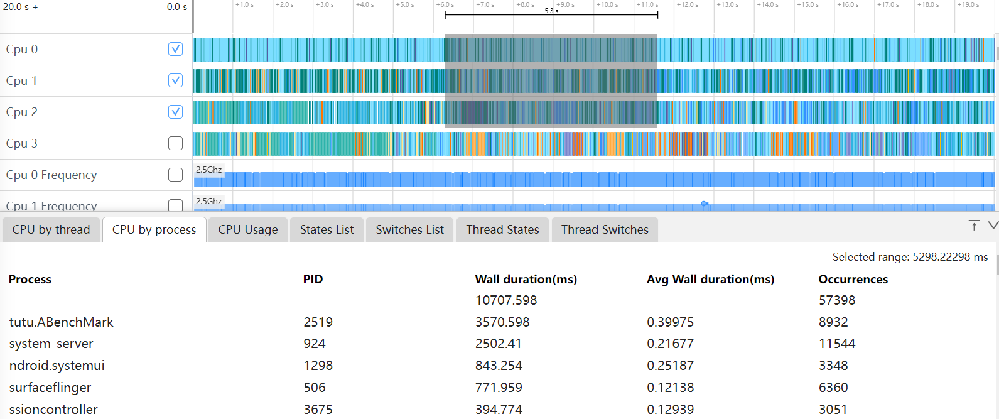
CPU Usage的Tab页，主要显示了在框选时间区间内，该频率时间占比前三的信息。
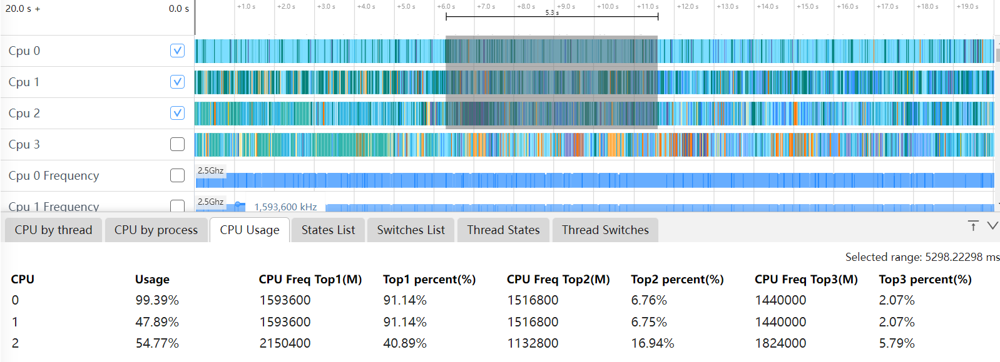
States List的Tab页，按状态>进程>线程的维度去统计，需要呈现该状态的线程名、该状态次数、该状态下时长、最大最小时长、平均时长、最大时长。
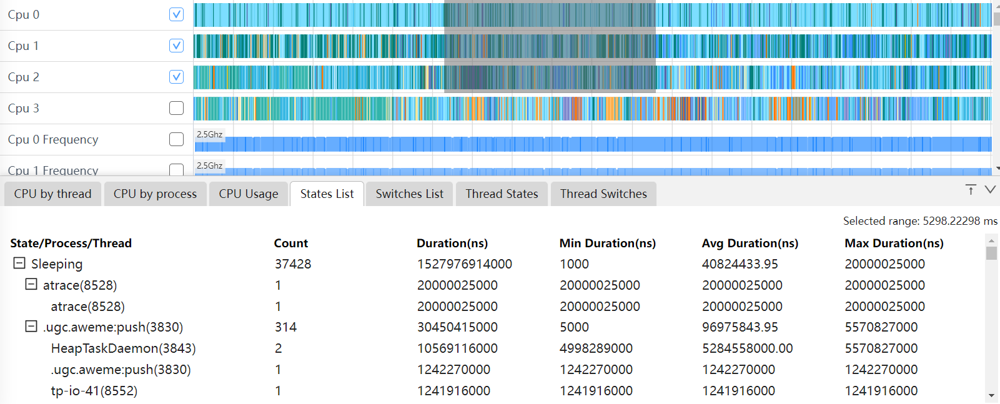
Switches List的Tab页，按照进程>线程>状态，统计对应状态下的次数。
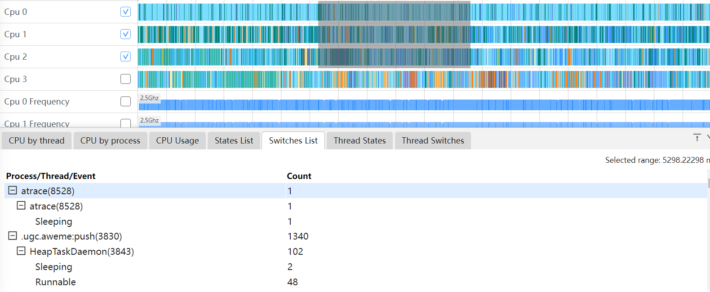
Thread States的Tab页，按进程>线程>状态的维度去统计，需要呈现该状态的线程名、进入该状态次数、该状态下时长、最小时长、平均时长、最大时长。
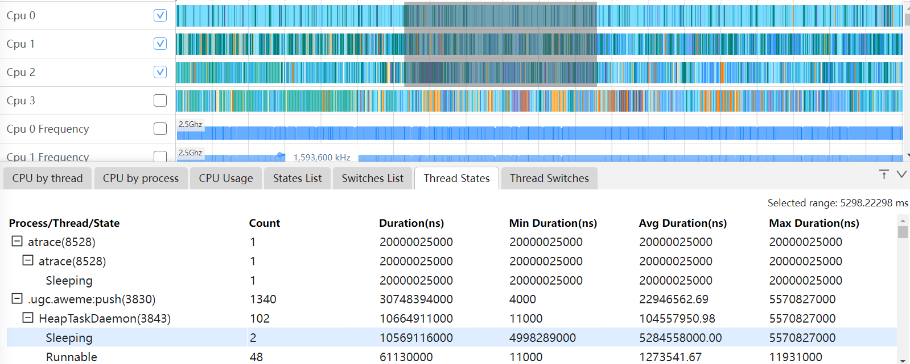
Thread Switches的Tab页，按照状态>进程>线程，统计对应状态下的次数。
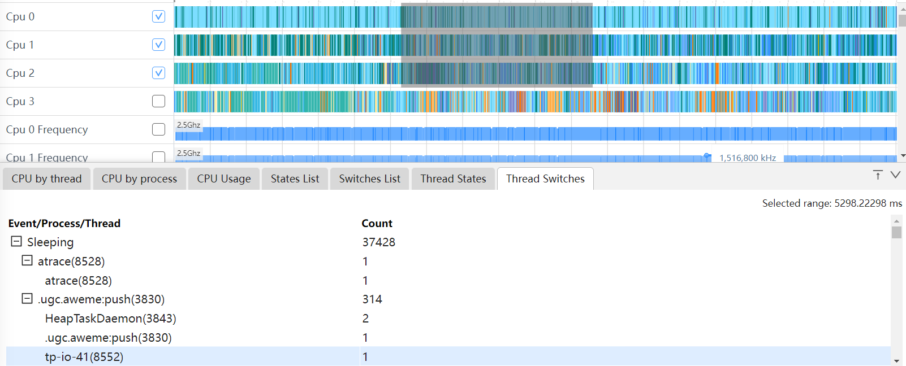
States List、Switches List、Thread States、Thread Switches的4个Tab页，点击移动到某一行，鼠标会变成一个小手的标志，点击一下，就会进入辅助信息界面，会将选中行的辅助信息展示出来，包括开始时间、进程、线程、线程状态、对应的CPU、优先级等信息如下图。
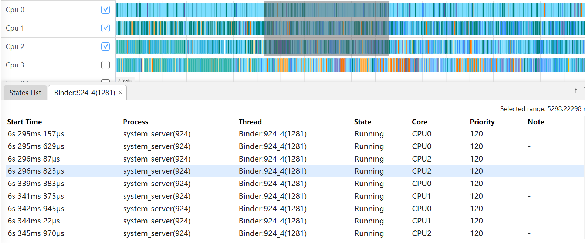
#### cpu使用情况的单选功能
单选CPU使用情况数据会在选中的色块外层加上深色边框，能够突出当前选中色块，弹出层中会展示当前CPU上的进程名，线程名，开始时间和运行时长，线程运行状态等信息。
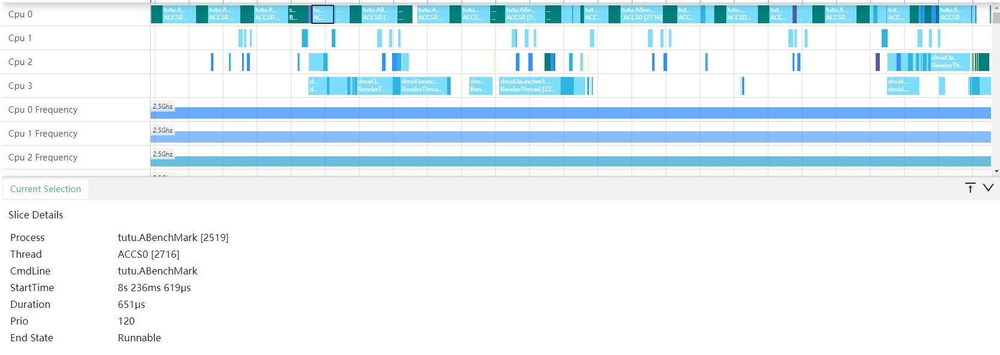
### 进程、线程和方法数据
下图是进程数据，左边部分展示进程名称和id，右边显示线程切换关系，线程的调用方法，进程间内存信息等。

点击进程名前面向下箭头可以展开对应的线程进行查看，展开后的线程如下图，如果存在堆内存占用情况，就会显示在第一行，如果出现两个名字和id一样的线程，则第一个为线程的使用情况，第二为线程内的方法栈调用情况。
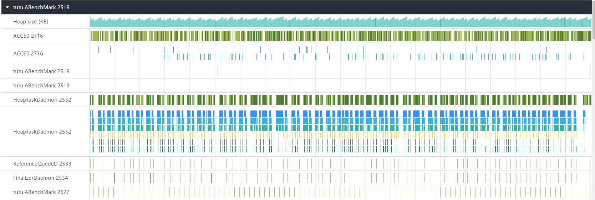
#### 进程、线程和方法数据的框选功能
可以对线程的数据进行框选，框选后在最下方的弹出层中会展示框选数据的统计表格，包含线程运行状态，线程调用栈的统计情况。当框选的数据中同时存在线程运行状态和线程调用栈数据，下方的弹出层中就会出现多个tab选项，可以进行切换。

下图是线程运行状态框选统计信息,包括进程名、进程号、线程名、线程号、线程状态、状态持续时间、平均持续时间、该线程状态发生的次数。

下图是线程调用栈框选统计信息,包括方法名、持续时间、平均持续时间、调用的次数。
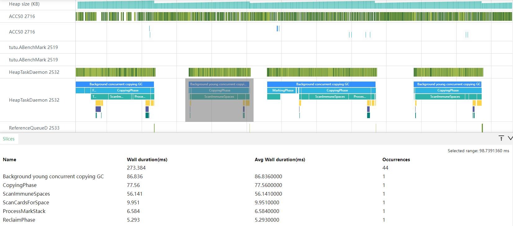
#### 进程、线程和方法数据的单选功能
单选线程的state数据时，会展示当前选中线程的状态数据，开始时间和持续时长，线程状态，所在进程名称。

单选调用栈数据，单击方法会在选中的方法外层加上黑色边框，能够突出当前选中的方法，弹出层中会展示当前方法的名称、开始时间和运行时长信息。

#### 线程的跳转功能
点击画红框处的带箭头的标志，会从CPU的线程概览视图跳转到线程的详情视图，同时从线程的详情视图也能跳转到CPU的线程概览视图。
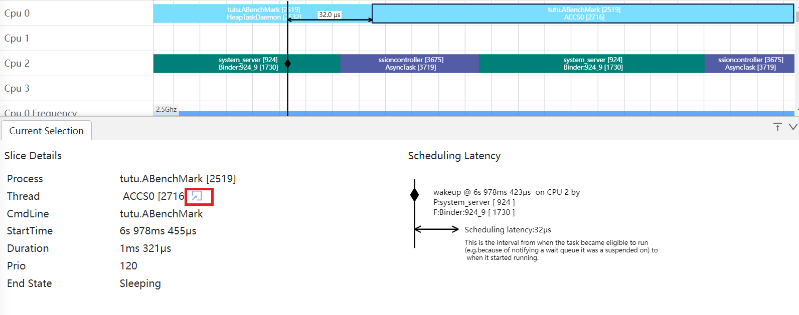
### trace的其他功能
#### 小旗标志的功能
将选中数据的时间点通过小旗的方式在时间轴上展示，直观的展示选中数据的时间。

在下方输入空输入文字:我是trace,可以给小旗打备注。
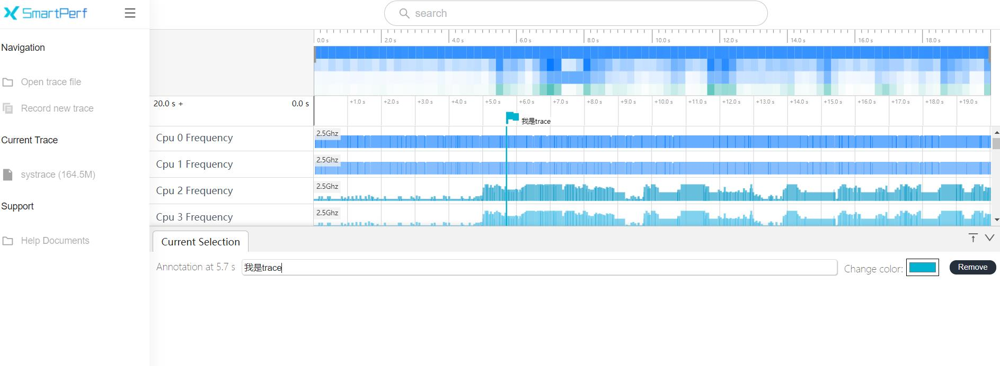
#### 收藏置顶功能
鼠标移动到某个页签，会出现星形的标志，点击该星形，可以将该行收藏置顶。
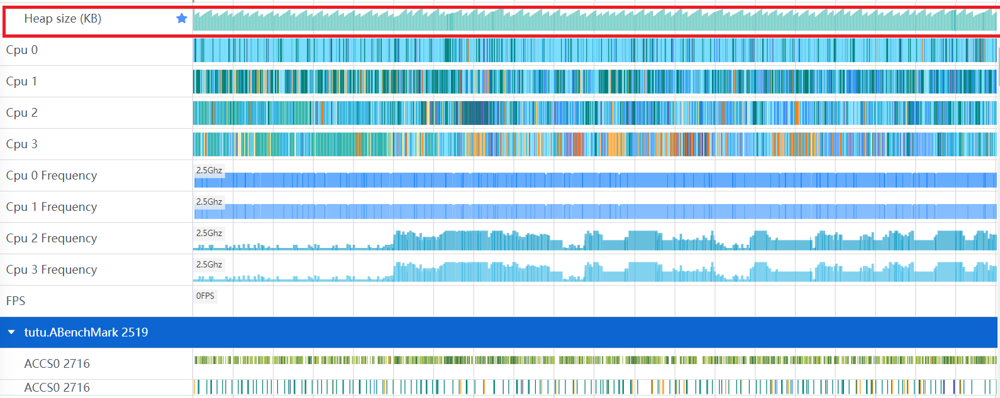
#### 勾选功能
框选某一区域，该区域左边会出现CheckBox的复选框，选中的区域的复选框会出现打勾的状态，可以取消勾选，也可以重新勾选。
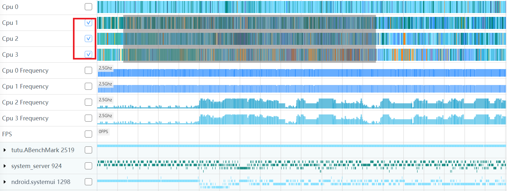
#### 搜索功能
在搜索框中，可以输入线程，线程号等搜索自己想要的信息，搜索完成会高亮显示。
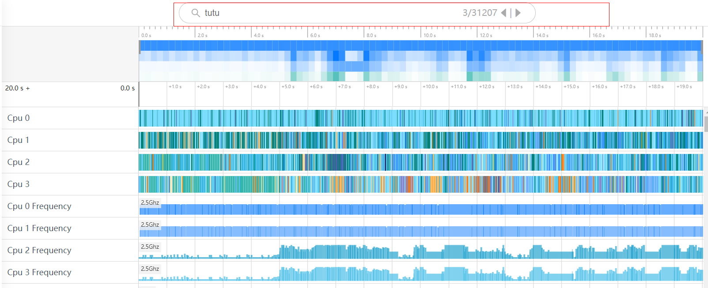
在搜索框中输入调用栈的方法名，会跳转到对应的调用栈。
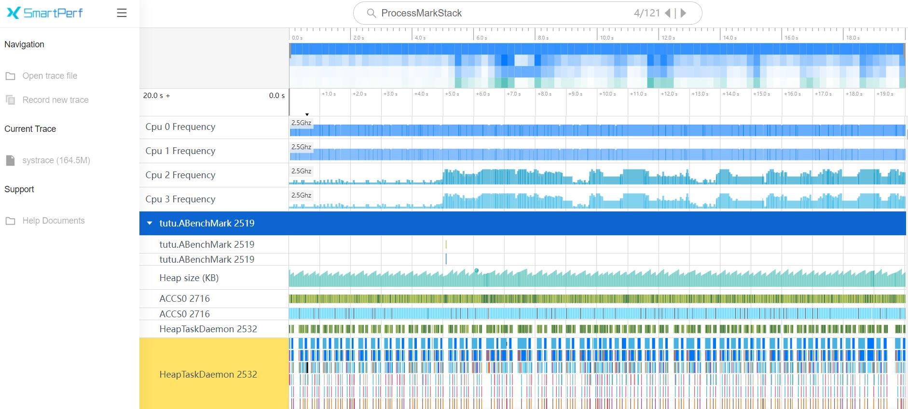
#### M键测量功能
放大trace中的色块，选中色块，键盘按下M，会出现像尺子一样的形状。
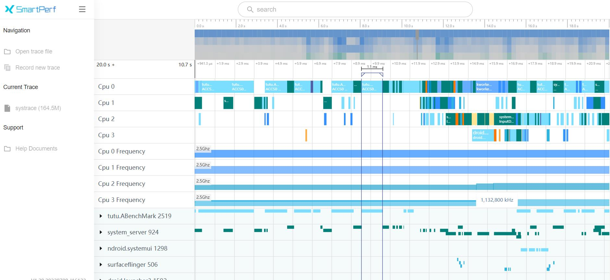