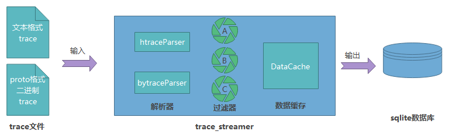

# trace_streamer工具说明
trace_streamer是一个trace数据流转化器，可以将一个trace文本文件或者基于proto序列化的二进制文件转换成为sqlite数据库的形式。 trace_streamer使用C++实现，支持在ohos, linux, windows, mac等系统上使用，具有良好的跨平台特性。  
   
## 关于trace解析工具的使用说明：
trace_streamer工具可以2种方式使用  
1. 可以将系统离线trace文件解析并转为db，此工具支持基于文本的trace和基于proto的trace。  
2. trace_streamer工具还可以WebAssembly的方式在浏览器中运行，需暴露相关接口给js文件。  
  
### 导出db模式
在导出db模式下，trace_streamer.exe trace文件路径名 -e 导出db路径名.db
此命令可以将trace文件转为db
本应用支持在ohos, linux, windows, mac使用。
关于db文件的说明：
使用db查看工具查看stat表，可以浏览当前数据一共有多少类数据，各类数据都收到多少条，数据是否正常等情况。在meta表会记录数据库导出时的一些系统信息，比如导入和导出的文件全路径，解析时间等信息。
meta表可以选择不导出（有些情况下会暴露系统敏感信息），在导出时添加 -nm选项即可。
在数据导出之后，会在本地目录下生成一个trace_streamer.log文件，在导出db的目录下生成一个数据库文件同名，.db.ohos.ts后缀的文件
文件内容如下：
时间戳:执行结果（数字）
应用运行时间

执行结果解释如下：0 代表执行成功 1 表示输入文件不匹配， 2 表示解析错误， 3其他错误
### 内置浏览器方式
trace_streamer可以WebAssembly方式在浏览器中运行，暴露如下接口给js
```
extern "C" {
/* 上传trace数据
 * 
 * @data: 数据的缓冲区 
 * @dataLen: 数据长度
 * 
 * return: 0：成功； -1：失败
*/
EMSCRIPTEN_KEEPALIVE int TraceStreamerParseData(const uint8_t* data, int dataLen);

/* 通知TS上传trace数据结束
 *  
 * return: 0：成功； -1：失败
*/
EMSCRIPTEN_KEEPALIVE int TraceStreamerParseDataOver();

/* 通过sql语句操作数据库
 * 
 * @sql: sql语句 
 * @sqlLen: sql语句长度
 * 
 * return: 0：成功； -1：失败
*/
EMSCRIPTEN_KEEPALIVE int TraceStreamerSqlOperate(const uint8_t* sql, int sqlLen);

/* 通过sql语句查询数据库
 * 
 * @sql: sql语句 
 * @sqlLen: sql语句长度
 * @out: 查询结果的缓冲区，查询结果为json
 * @outLen: 缓冲区长度
 * 
 * return: >0：查询成功，返回查询结果数据长度； -1：失败
*/
EMSCRIPTEN_KEEPALIVE int TraceStreamerSqlQuery(const uint8_t* sql, int sqlLen, uint8_t* out, int outLen);

} // extern "C"
```

### 你也可以执行如下命令查看应用帮助
./trace_streamer --help
-i 选项可查看应用支持的事件源和具体的事件名列表  

### trace_streamer支持解析的事件列表
支持的事件列表参见<<SupportEventList.md>>
## TraceStreamer重要概念介绍
### 1. 进程和线程标识符
```
在通用操作系统中，进程号（pid/tgid）和线程号（tid）可能会被重复用于标识不同的进程或者线程。所以在trace数据源中，进程号（pid）和线程号（tid）也可能被重用。 
TraceStreamer在解析数据过程中，使用ipid(internal pid)唯一标识进程， itid(internal tid)唯一标识线程。 
```
### 2. 计量器
用来记录系统中各种随时间连续变化的数值。例如： CPU的频率， 内存的使用量， 界面刷新频率。
#### 举例
CPU频率：  
![GitHub Logo][../figures/cpu_frequency.png]  
内存占用：  
![GitHub Logo][../figures/mem_usage.png]

### 3. 过滤器
TraceStreamer设计过程中使用了流式处理的思想，数据从入口进入以后，就像进入一条河流，从上游流向下游，在河道中央有很多过滤器，每种过滤器会将流过的数据中自己关注的内容吸附捕捉到。最终，每个过滤器都拥有了大量同类型的数据，而且这些数据都是按时间序列排列的。TraceStreamer使用filterid来标识同一种用途的数据，可以方便在UI中绘制。   
![image][filterimageid]  

## Stat表设计
具体内容参见 [des_stat](./des_stat.md)
## trace_streamer开发环境搭建和编译运行指引

本应用使用gn作为构建工具。
### 1、开发环境
ubuntu和mac使用vscode
# 对外部的依赖
本应用依赖与sqlite，protobuf(htrace解析部分依赖) 

本应用同时依赖于src/protos目录下文件来生成相关pb.h，pb.cc文件 

### 2.1、 编译linux和Mac版应用
在根目录下执行相关命令进行编译

### 2.2、 编译wasm
在根目录下执行相关命令进行编译

### 2.3、开始编译
具体方法可参考[compile_trace_streamer](./compile_trace_streamer.md)