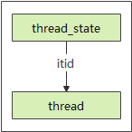
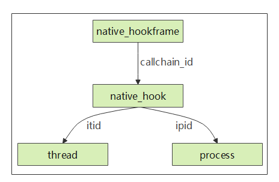

# ___概述TraceStreamer生成的数据库___
```
  TraceStreamer虽然对外提供了各种各样的使用方式，但核心的业务仍是将trace数据源转化为易于理解和使用的数据库。用户可以通过SmartPerf界面直观的研究系统跟踪数据，也可在理解TraceStreamer生成的数据库的基础上，在TraceStreamer的交互模式或者Smartperf的数据库查询模式下，使用SQL查询语句自由组装查看用户关心的数据。 下文将对TraceStreamer生成的数据库进行详细描述，给用户使用SQL查询系统跟踪数据提供帮助。
```

## ___TraceStreamer输出数据库包含以下表格___
* args ： 记录方法参数集合。
* callstack ： 记录调用堆栈和异步调用信息，其中depth,stack_id和parent_stack_id仅在非异步调用中有效。当cookid不为空时，为异步调用，此时callid为进程唯一号，否则为线程唯一号。
* clk_event_filter ： 记录时钟相关的信息。
* clock_event_filter ： 此结构用来维护时钟事件，cpu与唯一的ID做关联。
* cpu_measure_filter ： cpu事件过滤器表。
* cpu_usage ： 记录CPU使用率事件。
* data_dict ： 记录常用的字符串，将字符串和索引关联，降低程序运行的内存占用，用作辅助数据。
* data_type ： 记录数据类型和typeId的关联关系。
* diskio ： 记录磁盘读写数据事件。
* hidump ： 记录FPS（Frame Per Second）数据。
* instant :  记录Sched_waking, sched_wakeup事件， 用作ThreadState表的上下文使用。
* irq ： 记录中断相关事件。
* live_process ： 记录了一些实时的进程中执行的一些数据。
* log ： 记录hilog打印日志数据。
* measure ： 记录所有的计量值。
* measure_filter ： 记录一个递增的filterid队列，所有其他的filter类型在获取过程中，均从此数据列表中获取下一个可用的filter_id并做记录。
* meta ： 记录执行解析操作相关的基本信息。
* native_hook ： 记录堆内存申请与释放相关的数据。
* native_hook_frame ： 记录堆内存申请与释放相关的调用栈。
* network ： 抓取网络信息传输时产生的一些相关信息。
* perf_callchain ： 记录Hiperf采样数据的调用栈信息。
* perf_files ： 记录Hiperf工具采集到的函数符号表和文件名。
* perf_report ： 记录Hiperf工具采集数据时的配置信息。包括：抓取的事件类型，抓取数据的命令， 抓数据时指定的进程名称。
* perf_sample ： 记录Hiperf工具的采样信息。
* perf_thread ： 记录Hiperf工具采集到的进程和线程数据。
* process :  记录所有的进程信息。
* process_filter ： 过滤进程。
* process_measure_filter ： 将进程ID作为key1，进程的内存，界面刷新，屏幕亮度等信息作为key2，唯一确定一个filter_id。
* raw ： 此数据结构主要作为ThreadState的上下文使用，这张表是sched_waking,sched_wakup, cpu_idle事件的原始记录。
* sched_slice ： 此数据结构主要作为ThreadState的上下文使用，这张表是sched_switch事件的原始记录。
* stat ： 此结果用来统计数据解析中各类数据的数据条数，数据和合法性，数据的匹配程度（begin-end），数据的损失等，查看此结构对应的表，可对数据源有基本的了解。
* symbols ： 记录系统调用名称和其函数指针的对应关系，trace中用addr来映射function_name来节省存储空间。
* syscall ： 记录用户空间函数与内核空间函数相互调用记录。
* sys_event_filter ： 记录所有的filter。
* thread ： 记录所有的线程信息。
* thread_filter ： 过滤线程。
* thread_state ： 记录线程状态信息。
* trace_range ： 记录ftrace数据与其他类型数据的时间交集，供前端展示数据时使用。

## ___表格关系图___

### 进程表与线程表关系图：
 
### 描述：
当一个进程或者线程结束后，系统可能再次将该进程号或者线程号分配给其他进程或者线程，造成一个进程号或线程号代表多个进程或线程的情况。  
Process和Thread表中的id字段可以唯一标识进程和线程。process表中的id在其他表中用作ipid字段。thread表中的id在其他表中用作itid字段。   
thread表通过ipid字段关联process表的id字段，可以查询线程归属进程。
### 举例：
已知pid = 123,查看当前进程下的所有线程信息,可以使用如下SQL语句：  
select thread.* from thread, process where process.pid = 123 and thread.ipid = process.id

### 线程表与线程运行状态表关系图
 
### 描述：
thread_state表记录所有线程的运行状态信息，包含ts(状态起始时间)，dur(状态持续时间)，cpu, itid, state（线程状态）。 thread表的id字段与thread_state表的itid字段相关联。
### 举例：
已知tid = 123, 查看当前线程的所有运行状态信息，可以使用如下SQL语句：  
select thread_state.* from thread, thread_state where thread.tid = 123 and thread.id = thread_state.itid

### 堆内存数据变化表关系图
 
### 描述：
native_hook表记录堆内存申请(AllocEvent)和释放(FreeEvent)数据。native_hook表通过ipid和itid字段分别与process和thread表的id字段关联，通过eventId与native_hook_frame表的eventId字段相关联。 
native_hook表字段解释如下：  
    eventId: 唯一标识一次堆内存申请或释放， 通过与native_hook_frame表关联可以拿到当前申请或释放的函数调用堆栈。  
    addr： 堆内存申请/释放的地址  
    native_hook_size: 堆内存申请/释放的大小  
native_hook_frame表记录内存申请/释放的调用堆栈。通过eventId区分一组调用堆栈，depth为堆栈深度，depth为0时，表示当前行为栈顶数据。
### 举例：
已知tid = 123, 查看当前线程的所有堆内存变化信息，可以使用如下SQL语句：  
select native_hook.* from thread, native_hook where thread.tid = 123 and thread.id = native_hook.itid  
已知eventid = 0, 查看当前内存变化调用堆栈  
select * from native_hook_frame where eventId = 0

### 日志表与进程线程表关系图
 
### 描述：
log表记录日志信息。可以根据seq字段的连续性，来判断是否存在日志丢失的情况。
### 举例：
已知tid = 123, 查看当前线程的所有error级别的日志，可以使用如下SQL语句：  
select * from log where tid = 123 and level = "error"

### perf表间关系图
 
### 描述：
perf_report：此表记录Hiperf工具采集数据时的配置信息。  
perf_thread：此表记录hiperf采集到的进程和线程数据。  
perf_sample：此表中记录Hiperf工具的采样信息。sample_id唯一表识一次采样记录，与perf_callchain表中的sample_id字段相关联。thread_id为线程号。与perf_thread表中的thread_id字段相关联。event_type_id为当前采样的事件类型id，与perf_report表中的id字段相关联。  
perf_callchain：此表格记录的是调用栈信息。  
Perf_files：此表格主要存放着获取到的函数符号表和文件信息。file_id唯一表识一个文件，与perf_callchain表中的file_id字段相关联。
### 举例：
已知同步后的时间戳为28463134340470，查询采样数据  
select * from perf_sample where timestamp_trace = 28463134340470  

已知同步后的时间戳为28463134340470，查询采样数据对应的的调用栈信息  
select A.* from perf_callchain as A, perf_sample as B where B.timestamp_trace = 28463134340470 and A.sample_id = B.sample_id  

已知同步后的时间戳为28463134277762，查询采样数据的函数名及文件路径  
select A.*, B.name, C.path from perf_sample as A, perf_callchain as B, perf_files as C where A.timestamp_trace = 28463134277762 and B.sample_id = A.sample_id and B.callchain_id = 0 and B.file_id = C.file_id and C.serial_id = 0  

已知线程号为6700，查询所有的采样记录  
select * from perf_sample where thread_id = 6700  

已知进程号为7863，查询所有的采样记录  
select A.* from perf_sample as A, perf_thread as B where B.process_id = 7863 and A.thread_id = B.thread_id   

查询所有采样对应的事件类型  
select A.*, B.report_value from perf_sample as A, perf_report as B where A.event_type_id = B.id  

## TraceStreamer输出数据库表格详细介绍
### args表
#### 表结构：
| Columns Name | SQL TYPE |
|----          |----      |
|id            |INT       |
|key           |INT       |
|datatype      |NUM       |
|value         |INT       |
|argset        |INT       |
#### 表描述：
记录方法的参数集合
#### 字段详细描述：
Key：键  
Datatype：数据类型  
Value：取值  
Argset：参数集合

### callstack表
#### 表结构：
| Columns Name | SQL TYPE |
|----          |----      |
|id            |INT       |
|ts            |INT       |
|dur           |INT       |
|callid        |INT       |
|cat           |NUM       |
|name          |NUM       |
|depth         |INT       |
|cookie        |INT       |
|parent_id     |INT       |
|argsetid      |INT       |
|chainId       |NUM       |
|spanId        |NUM       |
|parentSpanId  |NUM       |
|flag          |NUM       |
|args          |NUM       |
#### 表描述：
记录调用堆栈和异步调用信息，其中depth,stack_id和parent_stack_id仅在非异步的调用中有效。当cookid不为空时，为异步调用，此时callid为进程唯一号，否则为线程唯一号。
#### 字段详细描述：
dur: 调用时长  
callid：调用者的ID，比如针对线程表里面的id  
name：调用名称  
depth：调用深度  
parent_id：父调用的id
spanId：分布式调用关联关系  
flag：C表示分布式调用发送方，S表示接受方  
args：分布式调用函数参数

### clk_event_filter表
#### 表结构：
| Columns Name | SQL TYPE |
|----          |----      |
|id            |INT       |
|type          |NUM       |
|name          |NUM       |
|cpu           |INT       |
#### 表描述：
记录时钟信息
#### 字段详细描述：
Type：时钟事件类型  
Name：时钟事件名称

### clock_event_filter表
#### 表结构：
| Columns Name | SQL TYPE |
|----          |----      |
|id            |INT       |
|type          |NUM       |
|name          |NUM       |
|cpu           |INT       |
#### 表描述：
此结构用来维护时钟事件，cpu与唯一的ID做关联
#### 主要字段描述：
Type：时钟事件类型  
Name：时钟事件名称

### cpu_measure_filter表
#### 表结构：
| Columns Name | SQL TYPE |
|----          |----      |
|id            |INT       |
|type          |NUM       |
|name          |NUM       |
|cpu           |INT       |
#### 表描述：
将cpu号作为key1，cpu的频率，空闲等状态作为key2，唯一确定一个filter_id
#### 主要字段描述：
Id(filterid), cpu：事件名称，cpu号

### cpu_usage表
#### 表结构：
| Columns Name | SQL TYPE |
|----          |----      |
|ts            |INT       |
|dur           |INT       |
|total_load    |REAL      |
|user_load     |REAL      |
|system_load   |REAL      |
|process_num   |INT       |
#### 表描述：
记录了与CPU使用率相关的数据
#### 主要字段描述：
total_load：总负荷  
user_load：用户负载  
system_load：系统负载  
process_num：线程数

### data_dict表
#### 表结构：
| Columns Name | SQL TYPE |
|----          |----      |
|id            |INT       |
|data          |NUM       |
#### 表描述：
此表记录了一个数据类型ID和字符串的映射。
#### 主要字段描述：
id：索引值  
data：字符串

### data_type表
#### 表结构：
| Columns Name | SQL TYPE |
|----          |----      |
|id            |INT       |
|typeId        |INT       |
|desc          |NUM       |
#### 表描述：
此表记录了一个数据类型ID和数据描述的映射。
#### 主要字段描述：
typeId:：数据类型id  
Desc：数据类型描述

### diskio表
#### 表结构：
| Columns Name | SQL TYPE |
|----          |----      |
|ts            |INT       |
|dur           |INT       |
|rd            |INT       |
|wr            |INT       |
|rd_speed      |REAL      |
|wr_speed      |REAL      |
|rd_count      |INT       |
|wr_count      |INT       |
|rd_count_speed  |REAL      |
|wr_count_speed  |REAL      |
#### 表描述：
记录了与磁盘读写相关的数据
#### 主要字段描述：
rd_sectors_kb：读数据的速度  
wr_sectors_kb：写入数据的速度  
ts：时间戳

### hidump表
#### 表结构：
| Columns Name | SQL TYPE |
|----          |----      |
|id            |INT       |
|ts            |INT       |
|fps           |INT       |
#### 表描述：
此表记录了设备的帧率信息，fps。
#### 相关字段描述：
fps：帧率值

### instant表
#### 表结构：
| Columns Name | SQL TYPE |
|----          |----      |
|ts            |INT       |
|name          |NUM       |
|ref           |INT       |
|ref_type      |NUM       |
#### 表描述：
记录了系统中的waking和wakeup事件。
#### 字段描述：
ts：唤醒时间  
name：唤醒事件的名称  
ref：索引号  
ref_type：索引类型

### irq表  
#### 表结构： 
| Columns Name | SQL TYPE |
|----          |----      |
|id            |INT       |
|ts            |INT       |
|dur           |INT       |
|callid        |INT       |
|cat           |NUM       |
|name          |NUM       |
|depth         |INT       |
|cookie        |INT       |
|parent_id     |INT       |
|argsetid      |INT       |
|chainId       |NUM       |
|spanId        |NUM       |
|parentSpanId  |NUM       |
|flag          |NUM       |
|args          |NUM       |
#### 表描述：
记录中断相关事件。
#### 相关字段描述：
dur：调用中断时长  
callid：调用中断者的ID，比如针对线程表里面的id  
name：调用中断的名称  
depth：中断调用的深度  
parent_id：父调用中断的id  
spanId：分布式调用中断关联关系

### live_process表
#### 表结构：
| Columns Name | SQL TYPE |
|----          |----      |
|ts            |INT       |
|dur           |INT       |
|cpu_time      |INT       |
|process_id    |INT       |
|process_name  |NUM       |
|parent_process_id   |INT       |
|uid           |INT       |
|user_name     |NUM       |
|cpu_usage     |REAL      |
|pss_info      |INT       |
|thread_num    |INT       |
|disk_writes   |INT       |
|disk_reads    |INT       |
#### 表描述：
记录了一些实时的进程中执行的一些数据。
#### 主要字段描述：
process_id：进程id  
process_name：进程名  
parent_process_id：父进程的id  
uid：用户id  
user_name：用户名  
cpu_usage：cpu使用率  
pss_info：进程信息  
thread_num：线程数量  
disk_writes：磁盘写量  
disk_reads：磁盘读量

### log表
#### 表结构：
| Columns Name | SQL TYPE |
|----          |----      |
|seq           |INT       |
|ts            |INT       |
|pid           |INT       |
|tid           |INT       |
|level         |NUM       |
|tag           |NUM       |
|context       |NUM       |
|origints      |INT       |
#### 表描述：
记录日志信息。
#### 关键字段描述：
Seq：日志序号，保证日志解析的准确性  
Ts：打印日志时间  
Pid：日志的进程号  
Tid：日志的线程号  
Level：日志级别  
Tag：日志标签  
Context：日志内容

### measure表
#### 表结构：
| Columns Name | SQL TYPE |
|----          |----      |
|type          |NUM       |
|ts            |INT       |
|value         |INT       |
|filter_id     |INT       |
#### 表描述：
记录所有的计量值。
#### 关键字段描述：
ts：事件时间  
value：数值  
filter_id：对应filter表中的ID

### measure_filter表
#### 表结构：
| Columns Name     | SQL TYPE |
|----              |----      |
|id                |NUM       |
|type              |NUM       |
|name              |INT       |
|source_arg_set_id |INT       |
#### 表描述：
记录一个递增的filterid队列，所有其他的filter类型在获取过程中，均从此数据列表中获取下一个可用的filter_id并做记录。
#### 字段详细描述：  
过滤分类（type），过滤名称（key2），数据ID(key1)。  
数据ID在process_measure_filter, sys_event_filter中作为id。

### meta表
#### 表结构：
| Columns Name | SQL TYPE |
|----          |----      |
|name          |NUM       |
|value         |NUM       |
#### 表描述：
此表记录了数据解析或导出时的一些现场数据，比如使用的trace_streamer版本， 工具的发布时间，数据解析的时间，数据的持续时长，以及原始数据的格式。
#### 主要字段描述：
Name：指定元数据的key  
Value：指定元数据的value

### native_hook表
#### 表结构：
| Columns Name | SQL TYPE |
|----          |----      |
|id            |INT       |
|eventId       |INT       |
|ipid          |INT       |
|itid          |INT       |
|event_type    |NUM       |
|sub_type      |NUM       |
|start_ts      |INT       |
|end_ts        |INT       |
|dur           |INT       |
|addr          |INT       |
|heap_size     |INT       |
|all_heap_size |INT       |
|current_size_dur   |INT       |
#### 表描述：
记录native_hook抓取的某个进程的堆内存，内存映射相关数据。
#### 关键字段描述：
eventId：唯一标识一条native_hook数据  
event_type：事件类型取值范围（AllocEvent,FreeEvent,MmapEvent, MunmapEvent）  
sub_type：子事件类型(只有sub_type字段为MmapEvent时，该字段才会有值)  
start_ts：申请内存开始时间  
end_ts：释放内存时间  
Dur：申请内存活跃时间  
Addr：申请内存地址  
mem_size：申请或释放内存大小  
all_mem_size：从采集数据开始到当前时刻，申请并活跃的内存总量。 event_type为AllocEvent或者FreeEvent时，表示活跃的堆内存总量。当event_type为MmapEvent或者MunmapEvent时，表示活跃的映射内存总量  
current_size_dur：表示当前活跃内存总量的持续时间

### native_hook_frame表
#### 表结构：
| Columns Name | SQL TYPE |
|----          |----      |
|id            |INT       |
|eventId       |INT       |
|depth         |INT       |
|ip            |INT       |
|sp            |INT       |
|symbol_name   |NUM       |
|file_path     |NUM       |
|offset        |INT       |
|symbol_offset |INT       |
#### 表描述：
记录了内存的申请和释放的堆栈。
#### 相关字段描述：
eventID：标识一组调用堆栈  
depth：调用栈深度  
symbol_name：函数名
file_payh：函数所属文件

### network表
#### 表结构：
| Columns Name | SQL TYPE |
|----          |----      |
|ts            |INT       |
|dur           |INT       |
|tx            |INT       |
|rx            |INT       |
|tx_speed      |REAL      |
|rx_speed      |REAL      |
|packet_in     |INT       |
|packet_in_sec |REAL      |
|packet_out    |INT       |
|packet_out_sec   |REAL      |
|net_type      |NUM       |
#### 表描述：
记录了网络数据传输相关的信息。
#### 主要字段描述：
tv_sec：时间，秒为单位  
tv_nsec：时间，纳秒为单位  
tx_bytes：网络数据的写入量  
rx_bytes：网络数据的读取量

### perf_callchain表
#### 表结构：
| Columns Name | SQL TYPE |
|----          |----      |
|id            |INT       |
|sample_id     |INT       |
|callchain_id  |INT       |
|vaddr_in_file |INT       |
|file_id       |INT       |
|symbol_id     |INT       |
#### 表描述：
记录了Hiperf采样数据的调用栈信息。
#### 主要字段描述：
Sample_id：与PerfSample中的Sample_id相关联。代表一次采样  
callchain_id： 调用栈深度  
vaddr_in_file：函数在文件中的虚拟地址  
file_id：与PerfFiles中的file_id字段相关联  
symbol_id：与PerfFiles中的symbol_id相关联

### perf_files表
#### 表结构：
| Columns Name | SQL TYPE |
|----          |----      |
|id            |INT       |
|file_id       |INT       |
|symbol        |NUM       |
|path          |NUM       |
#### 表描述：
记录Hiperf工具采集到的函数符号表和文件名。
#### 主要字段描述：
file_id：文件编号  
serial_id：一个文件中可能有多个函数，serial_id表示函数的编号  
symbol：函数名  
path：文件路径

### perf_report表
#### 表结构：
| Columns Name | SQL TYPE |
|----          |----      |
|id            |INT       |
|report_type   |NUM       |
|report_value  |NUM       |
#### 表描述：
记录Hiperf工具采集数据时的配置信息。包括：抓取的事件类型，抓取数据的命令， 抓数据时指定的进程名称。
#### 主要字段描述：
report_type：数据类型。取值只有三种类型：config_name（事件类型）, workload（抓取的进程名）, cmdline（抓取命令）  
report_value： 对应类型的取值

### perf_sample表
#### 表结构：
| Columns Name | SQL TYPE |
|----          |----      |
|id            |INT       |
|sample_id     |INT       |
|timestamp     |INT       |
|thread_id     |INT       |
|event_count   |INT       |
|event_type_id |INT       |
|timestamp_trace   |INT       |
|cpu_id        |INT       |
|thread_state  |NUM       |
#### 表描述：
记录Hiperf工具的采样信息。
#### 主要字段描述：
sample_id：采样编码  
timestamp：未进行时钟源同步的时间戳  
thread_id：线程号  
event_count：采样统计  
event_type_id：事件类型编号。与PerfReport表的id字段相关联  
timestamp_trace：时钟源同步后的时间戳  
cpu_id：cpu核编号  
thread_state：线程状态。采样对应Sched_Waking事件时，为Runing;对应Sched_Switch事件时，为Suspend。其余事件类型，为“-”

### perf_thread表
#### 表结构：
| Columns Name | SQL TYPE |
|----          |----      |
|id            |INT       |
|thread_id     |INT       |
|process_id    |INT       |
|thread_name   |NUM       |
#### 表描述：
记录Hiperf工具采集到的进程和线程数据。
#### 主要字段描述：
thread_id：线程号  
process_id：进程号  
thread_name：线程名

### process表
#### 表结构：
| Columns Name | SQL TYPE |
|----          |----      |
|id            |NUM       |
|type          |INT       |
|pid           |NUM       |
|name          |INT       |
|start_ts      |NUM       |
#### 表描述：
记录了进程相关数据。
#### 关键字段描述：
id：进程在数据库重新重新定义的id，从0开始序列增长  
pid：进程的真实id  
name：进程名字

### process_filter表
#### 表结构：
| Columns Name | SQL TYPE |
|----          |----      |
|id            |INT       |
|type          |NUM       |
|name          |NUM       |
|ipid          |INT       |
#### 表描述：
将进程ID作为key1，进程的内存，界面刷新，屏幕亮度等信息作为key2，唯一确定一个filter_id, filter_id同时被记录在filter表中。
#### 主要字段描述：
id：进程id  
type：进程类型  
name：进程名  
ipid：该进程表中的id与process表中的id相关联

### process_measure_filter表
#### 表结构：
| Columns Name | SQL TYPE |
|----          |----      |
|id            |INT       |
|type          |NUM       |
|name          |NUM       |
|ipid          |INT       |
#### 表描述：
将进程ID作为key1，进程的内存，界面刷新，屏幕亮度等信息作为key2，唯一确定一个filter_id, filter_id同时被记录在measure_filter表中。
#### 字段详细描述：
filterid：来自measure_filter表  
name：cpu状态名  
ipid：进程内部编号

### raw表
#### 表结构：
| Columns Name | SQL TYPE |
|----          |----      |
|id            |INT       |
|type          |NUM       |
|ts            |INT       |
|name          |NUM       |
|cpu           |INT       |
|itid          |INT       |
#### 表描述：
记录了系统中的waking、wakup、cpu_idel、cpu_frequency数据。
#### 相关字段描述：
name：调度名称  
cpu：事件发生在哪个CPU  
itid：时间对应哪个utid

### sched_slice表
#### 表结构：
| Columns Name | SQL TYPE |
|----          |----      |
|id            |INT       |
|type          |NUM       |
|ts            |INT       |
|dur           |INT       |
|cpu           |INT       |
|itid          |INT       |
|end_state     |NUM       |
|priority      |INT       |
#### 表描述：
此数据结构主要作为ThreadState的上下文使用，这张表是sched_switch事件的原始记录。
#### 主要字段描述：
Dur：状态持续时长  
ts：事件发生事件  
cpu：事件发生在哪个cpu  
itid：事件对应哪个utid  
end_state：线程的终结状态

### stat表
#### 表结构：
| Columns Name | SQL TYPE |
|----          |----      |
|event_name    |NUM       |
|stat_type     |NUM       |
|count         |INT       |
|serverity     |NUM       |
|source        |NUM       |
#### 表描述：
此结果用来统计数据解析中各类数据的数据条数，数据和合法性，数据的匹配程度（begin-end），数据的损失等，查看此结构对应的表，可对数据源有基本的了解。
#### 主要字段描述：
event_name：数据类型  
stat_type：数据状态  
count：数据条数  
severity：严重级别  
source：数据来源

### symbols表
#### 表结构：
| Columns Name | SQL TYPE |
|----          |----      |
|id            |INT       |
|funcname      |NUM       |
|addr          |INT       |
#### 表描述：
此表记录了数值和函数调用名称的映射关系。
#### 相关字段描述：
funcname：系统调用名称  
adr：系统调用地址

### sys_event_filter表
#### 表结构：
| Columns Name | SQL TYPE |
|----          |----      |
|id            |INT       |
|type          |NUM       |
|name          |NUM       |
#### 表描述：
记录所有的filter。
#### 相关字段描述：
type：文件类型  
name：文件名

### thread表
#### 表结构：
| Columns Name | SQL TYPE |
|----          |----      |
|id	           |INT	      |
|type	       |NUM	      |
|tid	       |INT	      |
|name	       |NUM	      |
|start_ts	   |INT	      |
|end_ts	       |INT	      |
|ipid	       |INT	      |
|is_main_thread|INT       |
#### 表描述  
记录了线程相关数据。
#### 字段详细描述：
id：线程在数据库重新重新定义的id，从0开始序列增长  
ipid：线程所属的进程id, 关联process表中的ID  
name：线程名字  
is_main_thread：是否主线程，主线程即该线程实际就是进程本身

### thread_filter表
#### 表结构：
| Columns Name | SQL TYPE |
|----          |----      |
|id            |INT       |
|type          |NUM       |
|name          |NUM       |
|itid          |INT       |
#### 表描述：
将线程ID作为key1，线程的内存，界面刷新，屏幕亮度等信息作为key2，唯一确定一个filter_id, filter_id同时被记录在filter表中。
#### 主要字段描述：
id：线程id  
type：线程类型  
name：线程名称  
itid：该表中的tid与thread表中的tid相关联

### thread_state表
#### 表结构：
| Columns Name | SQL TYPE |
|----          |----      |
|id            |INT       |
|type          |NUM       |
|ts            |INT       |
|dur           |INT       |
|cpu           |INT       |
|itid          |INT       |
|state         |NUM       |
#### 表描述：
记录了线程状态相关的数据。
#### 字段详细描述：
id：线程状态在数据库中的id，从0开始序列增长  
ts：该线程状态的起始时间  
dur：该线程状态的持续时间  
cpu：该线程在哪个cpu上执行（针对running状态的线程）  
itid：该状态所属的线程id, 关联线程表中的id  
state：线程实际的的状态值  
```  
'R', Runnable状态  
'S', interruptible sleep  
'D', uninterruptible sleep  
'T', Stoped  
't', Traced  
'X', ExitedDead  
'Z', ExitZombie  
'x', TaskDead  
'I', TaskDead  
'K', WakeKill  
'P', Parked  
'N', NoLoad  
```

### trace_range表
#### 表结构：
| Columns Name | SQL TYPE |
|----          |----      |
|start_ts      |NUM       |
|end_ts        |INT       |
#### 表描述：
记录解析解析开始时间以及结束时间。
#### 关键字段描述：
start_ts：trace的开始时间，纳秒为单位  
end_ts：trace的结束时间，纳秒为单位