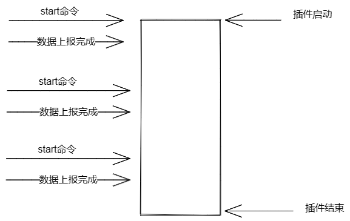
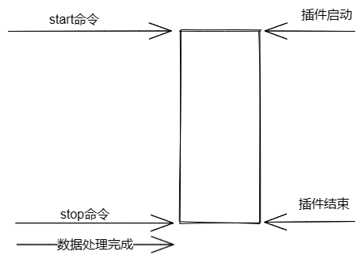
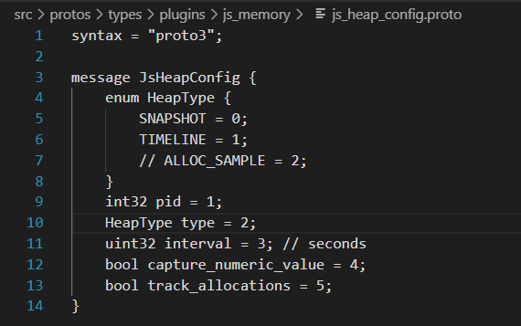
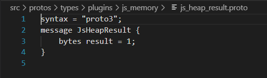
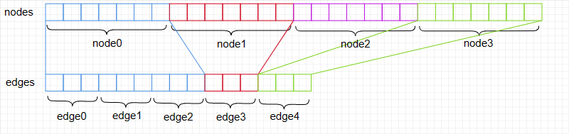

# JS内存数据说明

TraceStreamer支持解析JS内存采集的二进制数据，数据分为Snapshot和Timeline两种类型，解析结果输出js_heap_edges, js_heap_files, js_heap_info, js_heap_location, js_heap_nodes, js_heap_sample, js_heap_string, js_heap_trace_function_info, js_heap_trace_node共计九张表分别记录边缘信息，文件信息，数据类型， location节点信息，node节点信息，Timeline模式下的时间轴信息，字符串信息，Timeline模式下的调用栈函数信息，Timeline模式下的调用栈信息。

## 数据格式说明

数据采集时，Snapshot和Timeline只能选择其中一种，其中Snapshot为堆内存数据，可设置数据采集间隔，上报的数据为多组，以{"id":1,"result":{}}做为一次数据的结束标识。

*Snapshot模式下在下发start命令后立马开始上报数据直到本次抓取结束，数据上报完成之前都属于数据抓取过程。*

Timeline为时间轴数据，一个数据文件中只存在一组Timeline数据。以{"id":1,"result":{}}作为数据采集起始，{"id":2,"result":{}}作为数据采集结束。

*Timeline模式下发start命令后开始抓取，插件结束时下发stop命令停止抓取并开始上报数据。Start命令下发到stop命令下发之间属于数据抓取过程。*

## proto文件说明

JS内存数据解析对应两个proto文件

其中数据类型和pid通过JsHeapConfig获取，JsHeapResult外层有时间戳可以获取。

## Snapshot

一个Snapshot模式的文件包含有多组Snapshot数据，每一组以{"id":1,"result":{}}作为结束标识，Snapshot数据包含在json[params][ chunk]节点下，一条完整的Snapshot的数据会发送多次result，在收到结束标识之前，拼装所有的[chunk]节点下的result，即为一条完整的Snapshot数据。以此类推，解析至文件结束，可获取多条Snapshot数据。再用json库进行数据解析。

## Timeline

一个Timeline模式的文件包含有一组Timeline数据，以{"id":1,"result":{}}作为起始标识，以{"id":2,"result":{}}作为结束标识。Timeline数据包含在json[params][chunk]节点下，一条完整的Timeline数据会发送多次result，从收到起始标识开始，拼装每一条json[params][chunk]下的数据，直到收到结束标识，即可获取一条完整的Timeline数据。

### 数据解析

---

js memory的数据包含在htrace文件中，由proto文件定义数据格式，解析规则如下：

1.js-memory相关数据携带js-memory_config和js-memory插件头，先通过接口ParseJSMemoryConfig获取对应的type和pid，其中type=0为snapshot类型数据，type=1为timeline数据。js-memory数据为json格式，json包含以下节点：snapshot，nodes，edges，locations，strings，samples，trace_function_infos，trace_tree。使用第三方json库nlohmann::json进行解析。

2.json解析：snapshot和timeline两种数据类型json的解析规则是相同的。

snapshot：该节点包含js_heap_info表的信息，节点包括node、edge等节点对应的字段名称，数据类型和个数。

nodes：该节点包含了js_heap_nodes表的信息，每一行为7个int类型数字，分别表示type,name,id,self_size,edge_count,trace_node_id,detachedness。

edges：该节点包含了js_heap_edges表的信息，每一行为3个int类型数字，分别表示type，name_or_index，to_node。表中from_node_id是通过nodes节点的id和edgecount计算出的，nodes节点的每个edgecount对应的id即为edges节点的from_node_id。

例："nodes"

| type | name | id | self_size | edge_count | trace_node_id | datachedness |
| ---- | ---- | -- | --------- | ---------- | ------------- | ------------ |
| 9    | 1    | 1  | 0         | 3          | 0             | 0            |
| 9    | 2    | 3  | 0         | 2          | 0             | 0            |

则edges每个节点对应的from_node_id应为：

| from_node_id |
| ------------ |
| 1            |
| 1            |
| 1            |
| 3            |
| 3            |

locations：该节点包含了js_heap_location表的信息，目前尚无数据，暂不关注。

samples：该节点包含了js_heap_sample表的信息，每一行为两个int类型数字，分别表示timestam_us，last_assigned_id。

strings：该节点包含了js_heap_string表的信息，每一行为一个string类型的字符串，是js内存中字符串的集合，对应表中的string字段。

trace_function_infos：该节点包含了js_heap_trace_function_info表的信息，每一行为6个int类型的字符串，分别表示function_id，name，script_name，script_id，line，column。

trace_tree：该节点包含了js_heap_trace_node表的信息，是一个多维数组，每个数组由5个元素组成，分别为id，function_info_index，count，size和对应的子节点数组信息。由于不知道trace_tree节点的嵌套层数，需用递归方式解析每一层嵌套的节点。
